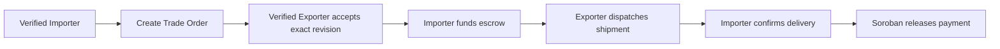
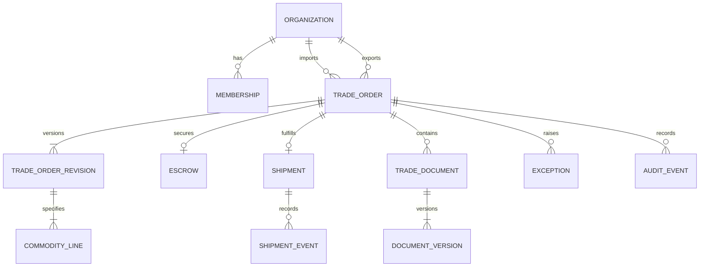

# Movix ASEAN Agricultural Trade Pivot

> Status: Current product and requirements authority  
> Decision date: July 29, 2026  
> Effective from: Sprint 6  
> Historical baseline: Sprints 0–5 remain preserved under their original terminology

## 1. Product decision

Movix is a non-marketplace B2B agricultural trade escrow platform for ASEAN. It helps importers and exporters that already know one another agree on a Trade Order, secure payment in Stellar escrow, record shipment evidence, confirm delivery, and release or refund funds with a shared audit trail.

Movix does not discover counterparties, negotiate commodity prices, book freight, operate warehouses, file customs declarations, certify goods, or provide trade finance, insurance, or automated dispute adjudication.

### Positioning

> Secure agricultural trade payments between trusted business partners.

For ASEAN agricultural importers and exporters with an existing commercial relationship, Movix provides a shared Trade Order and programmable escrow workflow linking payment to accepted terms, shipment evidence, delivery confirmation, and auditable approvals.

### Core journey

## 2. Market analysis

The initial serviceable segment is repeat or relationship-based cross-border trade involving agricultural exporters, importers, commodity traders, cooperatives with export capability, food manufacturers, and wholesale distributors.

The strongest early transaction has:

- known counterparties;
- negotiated commodity, quantity, price, delivery terms, and settlement asset;
- importer concern about advance-payment risk;
- exporter concern about shipping without funding assurance;
- trade documents and approvals fragmented across email, messaging, spreadsheets, and bank records; and
- a need for a common record of terms, funding, shipment, delivery, and release.

ASEAN’s official statistics recorded approximately USD 341 billion in agricultural trade in 2022. Agriculture, forestry, and fisheries together accounted for 12.4% of ASEAN merchandise trade that year. This demonstrates a large underlying trade domain, not Movix’s obtainable market. Corridor transaction counts, addressable order values, wallet readiness, willingness to pay, and regulatory eligibility still require primary customer and legal research.

The regional direction favors paperless trade, interoperable digital systems, and cross-border payments. It does not remove country-specific requirements for custody, escrow, digital assets, privacy, electronic records, customs, sanctions, or agricultural certification.

### Evidence and research backlog

Current evidence:

- [ASEAN Statistical Brief, April 2024](https://www.aseanstats.org/wp-content/uploads/2024/04/ASB-202404-02.pdf)
- [UN ESCAP Digital and Sustainable Trade Facilitation in ASEAN 2025](https://www.unescap.org/kp/2025/digital-and-sustainable-trade-facilitation-association-southeast-asian-nations-asean-2025)
- [OECD Digital Trade Review of ASEAN 2026](https://www.oecd.org/en/publications/digital-trade-review-of-the-association-of-southeast-asian-nations_abd6f44a-en/full-report/trade-digitalisation-and-asean_2dd064c3.html)

Before a production corridor is approved, validate:

- target origin–destination corridor and commodity;
- normal order value, payment terms, quantity tolerance, and document set;
- stablecoin, escrow, custody, money-transmission, and foreign-exchange rules;
- electronic-record and transferable-document recognition;
- organization-verification and transaction-screening obligations;
- willingness to use Stellar and the supported settlement asset; and
- pricing, buyer, implementation owner, and sales cycle.

## 3. Competitive analysis

Movix competes with direct workflow platforms and entrenched substitutes.

| Category / example | Strength | Movix opportunity | Boundary |
|---|---|---|---|
| Banks, letters of credit, documentary collections | Recognized controls and compliance | Simpler bilateral workflow and transparent programmable settlement | Movix must not claim equivalent legal or bank protection |
| [Covantis](https://covantis.io/) | Agricultural post-trade execution and document collaboration at global scale | Focus on known ASEAN counterparties and lightweight escrow | Covantis has deeper commodity-network execution |
| [AgriDigital](https://www.agridigital.io/) | Agricultural contracts, delivery, inventory, settlement, and reporting | Cross-border importer–exporter escrow without inventory operations | Movix intentionally excludes inventory and price discovery |
| [TradeWaltz](https://www.tradewaltz.com/en/) | Cross-company trade-document collaboration and Asian interoperability | Narrower agricultural Trade Order and settlement experience | Movix is not a general national trade-document network |
| [Komgo](https://www.komgo.io/) | Multi-bank commodity trade finance | Lower-complexity escrow for bilateral pilot trades | Movix does not digitize letters of credit or bank guarantees |
| ERP/procurement suites | Existing approvals and records | Shared cross-company agreement and settlement state | Movix should integrate later, not replace ERP |
| Email, messaging, spreadsheets, bank transfers | Familiar, flexible, low apparent cost | One authorized, versioned, auditable record | Adoption must beat manual-workflow friction |

Competitive differentiation to test:

- agricultural Trade Order and escrow in one bilateral record;
- immutable accepted commodity and route terms;
- shared importer/exporter action ownership;
- document-linked shipment and delivery evidence;
- transparent Stellar settlement state; and
- less operational scope than a full trade-management suite.

The product must compete on lower-friction agricultural trade execution, not “blockchain escrow” alone.

## 4. Personas and jobs

| Persona | Primary job | Critical need |
|---|---|---|
| Importer Trade Manager | Control payment exposure while keeping a shipment moving | Exact accepted terms, funding review, shipment visibility, delivery confirmation |
| Exporter Sales/Operations Manager | Verify secured payment and prove performance | Funding assurance, exact-revision acceptance, shipment and document evidence |
| Commodity Trader | Coordinate multiple bilateral trades | Action-focused status across terms, documents, shipment, and settlement |
| Cooperative Manager | Represent aggregated production | Simple commodity, lot, quality, quantity, and certificate capture |
| Food Manufacturer / Wholesale Buyer | Secure repeat agricultural inputs | Approvals, arrival visibility, and audit history |
| Finance / Treasury Officer | Fund and reconcile settlement | Exact amount, asset, network, wallet, transaction, fee, and release evidence |
| Compliance / Organization Administrator | Control verified participation | Legal identity, roles, verification state, and transaction eligibility |
| Auditor / Reviewer | Inspect evidence without mutation rights | Immutable terms, amendments, documents, events, and chain references |

## 5. MVP scope

### Included

- SEP-10 wallet authentication and organization-scoped authorization;
- verified importer and exporter organizations;
- invitation and binding for an intended exporter, without discovery;
- Trade Order drafting, exact-revision acceptance, rejection, and re-acceptance;
- one or more commodity lines using the existing line model;
- commodity, quantity, unit of measure, origin, destination, shipment/arrival window, and optional Incoterm with named place;
- escrow funding using the existing supported assets and Soroban contract;
- one shipment, full delivery, full release, and full refund;
- shipment status and evidence;
- private, versioned Trade Documents;
- Delivery Confirmation, payment release, exceptions, history, and reconciliation; and
- testnet pilot evidence.

### Deferred

- marketplace discovery, listings, bidding, and price discovery;
- split shipments, multiple lots, partial delivery, and partial release;
- automated quality adjustment, inspection, customs, sanctions, or certificate determination;
- logistics booking, carrier integration, warehousing, and inventory;
- FX conversion, additional settlement assets, trade finance, insurance, and lending;
- OCR, document extraction, eBL legal transfer, IoT, and automated dispute adjudication.

## 6. Business requirements

| ID | Priority | Requirement |
|---|---|---|
| BR-01 | P0 | Only an explicitly verified organization may issue, accept, fund, ship, confirm, or release a Trade Order. |
| BR-02 | P0 | Server-derived roles control create, accept/reject, fund, dispatch, confirm, refund, administer, and read-only actions. |
| BR-03 | P0 | Trade Order, shipment, and escrow use separate state machines with explicit allowed transitions. |
| BR-04 | P0 | Accepted commercial terms are immutable; any material change creates a new revision and requires Exporter re-acceptance. |
| BR-05 | P0 | A commodity line records commodity, exact quantity, controlled UOM, price, origin, destination, and any agreed specification. |
| BR-06 | P0 | Shipment and arrival windows are unambiguous; an Incoterm requires its edition, rule, and named place. |
| BR-07 | P0 | The Exporter can verify the exact funded amount, asset, network, contract, and committed terms before dispatch. |
| BR-08 | P0 | Shipment evidence and Trade Documents are access-controlled, versioned, attributable, and auditable. |
| BR-09 | P0 | Only an authorized Importer may confirm delivery and invoke the preserved release path. |
| BR-10 | P0 | Cancellation after funding cannot bypass the contract refund/cancellation path. |
| BR-11 | P0 | An active exception or dispute raised before release blocks normal release until the documented resolution policy is satisfied. |
| BR-12 | P0 | Each actionable state identifies the next responsible party and produces a durable notification/audit event. |
| BR-13 | P0 | Amount, quantity, unit, asset precision, fees, dates, and timezones are consistent across UI, API, database, hashing, and contract integration. |
| BR-14 | P0 | Existing Sprint 0–5 records, IDs, hashes, events, evidence, and deep links remain resolvable. |

## 7. Domain model

Canonical entities:

- **Organization:** legal identity, jurisdiction, capability, verification, wallets, and memberships.
- **Trade Order:** importer, exporter, current revision, lifecycle projections, settlement link, and exception state.
- **Trade Order Revision:** immutable commercial snapshot, schema version, terms hash, decision, actor, and time.
- **Commodity Line:** commodity, description/grade/variety, exact quantity/UOM, price, packaging, origin, and optional tolerance.
- **Shipment:** one per MVP Trade Order; planned and actual dates, route, state, references, and evidence manifest.
- **Trade Document / Version:** type, storage key, SHA-256 digest, size/MIME, uploader/issuer, issue/expiry dates, visibility, malware state, and review state.
- **Escrow:** existing contract/network/asset/amount/state and transaction projections.
- **Delivery Confirmation:** Importer actor, timestamp, receipt-manifest digest, and release transaction.
- **Exception / Dispute:** category, actor, evidence, release-blocking flag, state, and resolution.

## 8. Agricultural and cross-border business rules

### MVP rules

- **AGR-01 — Exact units:** Quantity and pricing units use controlled codes and exact decimal handling. No implicit conversion or floating-point rounding is allowed.
- **AGR-02 — No silent substitution:** Commodity, origin, grade, crop year, packaging, quality specification, quantity/UOM, or tolerance changes are material amendments.
- **AGR-03 — Final quantity:** If delivered quantity changes payable value, parties amend or enter the exception/refund path; Movix never infers a new price.
- **AGR-04 — Evidence neutrality:** “Dispatched,” “delivered,” or a certificate upload is a party declaration unless an external verification source is identified.
- **AGR-05 — Document history:** Replacing a document creates a new immutable version. A document committed as a commercial term requires re-acceptance when changed.
- **XBR-01 — Jurisdictions:** Origin, destination, Importer jurisdiction, and Exporter jurisdiction are explicit.
- **XBR-02 — Incoterms:** Store the edition, rule, and named place; Movix records the agreement but does not interpret or guarantee legal obligations.
- **XBR-03 — Time:** Store timestamps in UTC and display an explicit user/organization timezone. Business date windows cannot be reversed.
- **XBR-04 — Settlement:** Asset, network, amount, parties, beneficiary wallet, fees, and terms hash are accepted and verified before funding.
- **XBR-05 — Verification:** Organization and corridor-specific transaction eligibility checks pass before consequential actions. No verification is inferred during migration.
- **XBR-06 — Expiry:** Acceptance and funding deadlines have explicit, idempotent outcomes and never move or release funds silently.
- **XBR-07 — Retention/privacy:** Commercial documents use private storage, least-privilege access, auditable downloads, and a corridor-approved retention policy.
- **XBR-08 — Legal neutrality:** Movix does not label goods customs-cleared, certified, compliant, or authentic without recording the verifying source and basis.
- **XBR-09 — Exception hold:** A timely release-blocking exception disables normal release; the MVP must have a documented manual resolution/refund policy.

### Decisions required before production

- pilot corridors and which side must be in ASEAN;
- supported commodities, UOMs, tolerances, and required document types;
- organization-verification evidence and operator process;
- legal status of escrow and supported digital assets in each corridor;
- applicable privacy, data-transfer, electronic-record, and retention obligations;
- dispute authority, service-level targets, and release/refund deadlock procedure.

## 9. Success and release gates

North-star metric: **funded Trade Orders settled correctly**, either released to the Exporter or refunded without manual database correction.

Pilot indicators:

- verified Importer-to-Exporter Trade Order completion;
- time from issue to acceptance and acceptance to funding;
- percentage of funded trades dispatched and settled without operator repair;
- re-acceptance and stale-write correctness;
- migration reconciliation variance;
- document/access-control failures;
- settlement projection mismatch and recovery time.

No mainnet pilot proceeds without corridor legal review, organization verification, secure document operations, escrow invariant regression, authenticated two-party end-to-end evidence, migration reconciliation, security/accessibility testing, observability, and release sign-off.
