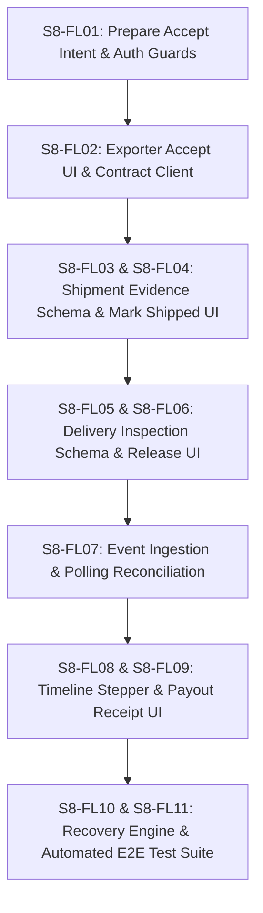

# Movix Sprint 8 - Trade Fulfillment, Delivery Confirmation, and Escrow Release

> Status: Implementation-ready; external entry and release gates remain open  
> Duration: 2 weeks  
> Primary implementer: Elliot  
> Target: Stellar Testnet only  
> Primary surface: Fulfillment & Release panels on `/orders/[orderId]` and `/trade-orders/[orderId]`  
> Sprint authority: [Movix Sprint Plan](./Movix-Sprint-Plan.md)  
> Product authority: [Movix ASEAN Agricultural Trade Pivot](./Movix-ASEAN-Agricultural-Trade-Pivot.md)  
> Architecture authority: [Agricultural Trade Architecture and Sprint 6 Migration](./agricultural-trade-architecture-and-migration.md)  
> Contract authority: [Escrow v1 ABI](./contracts/escrow-v1/abi.md) and [deployment manifest](../deployments/stellar/testnet/escrow-v1.json)  
> Preceding sprint: [Sprint 7 Escrow Funding Integration](./Movix-Sprint-07-Escrow-Funding-Detailed.md)

---

## 1. Sprint goal

Deliver the complete post-funding fulfillment, delivery confirmation, and escrow release lifecycle for ASEAN agricultural trade orders on Stellar Testnet.

Sprint 8 proves the core value proposition of Movix: **an accepted and funded agricultural Trade Order transitions through verified Exporter contract activation, recorded shipment evidence, Importer delivery confirmation, and atomic Soroban token release directly to the Exporter's wallet without manual database overrides or intermediary custody**.

---

## 2. Demo

Using two distinct authenticated and verified QA organizations (Importer and Exporter):

1. **Exporter Activation (`accept`)**: The Exporter opens a `Funded` Trade Order (e.g. 500 USDC), reviews the on-chain escrow facts, verifies that contract `accept_by` is unexpired, and invokes `accept(id, supplier, terms_hash)`. Wallet signs, transaction finality confirms, and on-chain escrow status moves from `Funded` to `Accepted`.
2. **Exporter Shipment (`mark_shipped`)**: The Exporter inputs agricultural shipment evidence (Bill of Lading / Air Waybill, carrier, ASEAN phytosanitary certificate reference). The system computes a deterministic 32-byte `shipment_hash`. The Exporter invokes `mark_shipped(id, supplier, shipment_hash)`. Escrow status moves on-chain from `Accepted` to `Shipped`.
3. **Importer Delivery Confirmation & Release (`confirm_delivery`)**: The Importer reviews the shipment details, performs receiving inspection, records a delivery confirmation payload, and computes a 32-byte `delivery_hash`. The Importer invokes `confirm_delivery(id, buyer, delivery_hash)`.
4. **Atomic Token Payout**: The Soroban contract transfers `net_amount` (500 USDC) from contract custody directly to the Exporter's wallet address, reduces contract liability to 0, and updates escrow status to `Released`.
5. **Both-Party Receipt & Audit Trail**: Both parties view the reconciled trade completion timeline, transaction hashes for all 3 operations, on-chain ledger timestamps, exact token payout receipt, and immutable commitment hashes.
6. **Resilience Verification**: The demo proves recovery from wallet rejections, network latency, browser reloads mid-submission, and stale client state.

---

## 3. Outcome and success measures

Sprint 8 is successful when:

- 100% of valid funded trade orders can proceed through Exporter acceptance, shipment recording, delivery confirmation, and token release without developer intervention;
- Escrow contract `accept`, `mark_shipped`, and `confirm_delivery` execute atomically with zero token loss or unaccounted contract liability;
- 0% of unconfirmed or failed transaction attempts are presented as `Shipped` or `Released`;
- Importer and Exporter frontends stay strictly synchronized with on-chain Soroban `get_escrow` getter facts;
- Interrupted or reloaded browser sessions seamlessly resume pending finality without creating duplicate on-chain transactions;
- All P0 acceptance criteria and automated test gates in this document pass.

---

## 4. Entry gates

Sprint 8 implementation may begin once Sprint 7 funding integration is functional on Testnet. Sprint 8 must not be declared complete or enabled for pilot users until these gates are satisfied.

### 4.1 Sprint 7 prerequisite gates

- [ ] Escrow funding (`create_and_fund`) is functional on Testnet for XLM SAC and allowlisted USDC SAC.
- [ ] Escrow contract ID `CCEECHOGV6MXZANAOLJNDMA2GPEBDETPNWUR4XDEW32KHJUYN3V5ZAP5` is verified and pinned.
- [ ] Deterministic escrow key derivation is proven identical across frontend, backend, and contract integration tests.
- [ ] Soroban getter `get_escrow(id)` reconciliation and cursor-based event polling are operational in Convex.

### 4.2 Contract ABI verification gates for Sprint 8

- [ ] `accept` ABI signature: `accept(id: BytesN<32>, supplier: Address, terms_hash: BytesN<32>) -> Escrow`
- [ ] `mark_shipped` ABI signature: `mark_shipped(id: BytesN<32>, supplier: Address, shipment_hash: BytesN<32>) -> Escrow`
- [ ] `confirm_delivery` ABI signature: `confirm_delivery(id: BytesN<32>, buyer: Address, delivery_hash: BytesN<32>) -> Escrow`
- [ ] Release payout calculation verified: `fee_amount = floor(gross_amount * fee_bps / 10_000)`; `net_amount = gross_amount - fee_amount`. With `fee_bps = 0`, `net_amount == gross_amount`.
- [ ] Event topics verified: `("escrow", "accepted")`, `("escrow", "shipped")`, `("escrow", "released")`.

---

## 5. Product decisions for Sprint 8

These decisions are part of the committed implementation. Elliot must follow them exactly as defined:

| Decision | Sprint 8 Rule |
|---|---|
| **Network** | Testnet only. Mainnet requests fail-closed. |
| **Contract Authority** | Soroban escrow v1 contract is the absolute authority for escrow status, liability, and payout transfer. Convex stores off-chain evidence, document metadata, audit logs, and reconciled projections. |
| **Exporter Activation (`accept`)** | Mandatory before shipping. The Exporter wallet must sign `accept` while status is `Funded` and `now < accept_by`. |
| **Shipment Evidence (`mark_shipped`)** | Exporter provides off-chain logistics details (carrier, tracking ID, phytosanitary certificate ID). Movix derives `shipment_hash` = SHA-256 over canonical shipment payload JSON. `shipment_hash` must be non-zero `BytesN<32>`. |
| **Delivery Confirmation (`confirm_delivery`)** | Importer provides off-chain inspection confirmation (receiving report ID, inspection status, received date). Movix derives `delivery_hash` = SHA-256 over canonical delivery payload JSON. `delivery_hash` must be non-zero `BytesN<32>`. |
| **Fee & Payout** | `max_fee_bps = 0`. Exporter receives 100% of gross escrow tokens upon delivery confirmation. Treasury receives 0. |
| **Authorization** | `accept` & `mark_shipped` strictly require an authenticated Exporter user with role `owner`, `admin`, or `operations` for the supplier org. `confirm_delivery` strictly requires an authenticated Importer user with role `owner`, `admin`, or `finance` for the buyer org. |
| **Terminal State** | `Released` is a terminal on-chain state. Once released, escrow liability is 0 and no further contract transitions are permitted. |
| **No Contract Changes** | Escrow contract WASM, ABI, and deployment are frozen. No Rust contract modifications are in scope. |

---

## 6. Detailed Scope

### 6.1 In Scope

- Exporter activation panel and `accept` transaction review, simulation, signing, and reconciliation UI;
- Agricultural shipment evidence form, off-chain JSON schema, SHA-256 `shipment_hash` derivation, and `mark_shipped` transaction workflow;
- Importer receiving inspection form, off-chain delivery confirmation schema, SHA-256 `delivery_hash` derivation, and `confirm_delivery` transaction workflow;
- Soroban event listener and getter polling updates for `Accepted`, `Shipped`, and `Released` events;
- Both-party unified trade lifecycle stepper and detailed milestone progress component;
- Both-party settlement receipt displaying gross amount, fee (0), net payout, Exporter destination wallet, Stellar transaction hash, and block timestamp;
- Recovery engine for stalled transactions, interrupted wallet sign requests, and RPC sync delays;
- Comprehensive test coverage: unit tests for argument preparation, Convex mutation authorization tests, Playwright end-to-end user journeys, and local ledger Soroban execution tests.

### 6.2 Not in Scope

- Contract refund flow (`propose_refund`, `approve_refund`, `reject_refund`, `withdraw_refund`) – Deferred to Sprint 9;
- Contract cancellation flow (`cancel_unaccepted`) – Deferred to Sprint 9;
- Partial releases, split shipments, or multi-tranche payments;
- Mainnet deployment;
- Physical logistics API integrations (automated customs/port API calls).

---

## 7. Backlog Traceability

Execution IDs for Sprint 8 use prefix `S8-FL` (Fulfillment & Release).

| Execution ID | Priority | Discipline | Deliverable Summary |
|---|---|---|---|
| **S8-FL01** | P0 | Backend, Web | Exporter activation eligibility check and `accept` argument preparation |
| **S8-FL02** | P0 | Web, Stellar | Exporter escrow `accept` review, simulation, signing, & submission UI |
| **S8-FL03** | P0 | Backend, Web | Agricultural shipment evidence schema & SHA-256 `shipment_hash` generator |
| **S8-FL04** | P0 | Web, Stellar | Exporter `mark_shipped` review, simulation, signing, & submission UI |
| **S8-FL05** | P0 | Backend, Web | Importer delivery receiving inspection schema & SHA-256 `delivery_hash` generator |
| **S8-FL06** | P0 | Web, Stellar | Importer `confirm_delivery` review, simulation, signing, & escrow release UI |
| **S8-FL07** | P0 | Backend, Stellar | Event ingestion & getter reconciliation for `Accepted`, `Shipped`, & `Released` |
| **S8-FL08** | P0 | Web, Design | Unified trade fulfillment stepper & milestone status timeline component |
| **S8-FL09** | P0 | Web, Design | Both-party confirmed settlement & token payout receipt component |
| **S8-FL10** | P0 | Web, Backend | Transaction interruption, wallet disconnect, & pending-finality recovery |
| **S8-FL11** | P0 | QA, Web | End-to-end Playwright, Convex, and Soroban integration test suite |

---

## 8. Detailed Stories and Acceptance Criteria

### S8-FL01 - Exporter Activation Eligibility & Argument Preparation

**User/System Story:** As Movix, I ensure only the authorized Exporter can generate valid `accept` contract call arguments for a `Funded` escrow.

**Implementation Details:**
- Add a Convex query/mutation `packages/backend/convex/tradeOrders.ts` (or `escrows.ts`): `prepareAcceptIntent`.
- Verification logic:
  - Caller belongs to the Exporter organization (`supplierOrganizationId`).
  - Caller has role capability `escrow:accept` (`owner`, `admin`, `operations`).
  - Trade Order status is `funded` (escrow status `Funded`).
  - Escrow deadline `accept_by` is greater than current ledger time + 300 seconds safety buffer.
  - Exporter connected wallet matches the snapshotted `supplier` address stored during `create_and_fund`.
- Inputs produced:
  - `id`: 32-byte `BytesN<32>` escrow key (hex digest string converted to buffer).
  - `supplier`: Exporter Stellar wallet address (`Address`).
  - `terms_hash`: 32-byte `BytesN<32>` matching the accepted revision's `order-terms-v2` hex hash.

**Acceptance Criteria:**
- Importer users or unauthenticated callers calling `prepareAcceptIntent` receive authorization error `NOT_AUTHORIZED_EXPORTER`.
- If `accept_by` is within 300 seconds of expiration or already passed, backend returns `ESCROW_DEADLINE_EXPIRED`.
- Exporter address must match snapshotted supplier address exactly; mismatch throws `WALLET_ADDRESS_MISMATCH`.
- Re-querying returns deterministic, identical arguments.

---

### S8-FL02 - Exporter Escrow Acceptance (`accept`) Workflow

**User Story:** As an Exporter operations/finance manager, I review the funded escrow and sign the `accept` transaction to lock in fulfillment commitment.

**Implementation Details:**
- Build `ExporterAcceptModal` or panel on `/orders/[orderId]` (and `/trade-orders/[orderId]`).
- Display:
  - Action: "Accept Escrow & Commit Fulfillment"
  - Escrow Gross Amount & Asset (e.g. 500.00 USDC)
  - Importer Organization name & wallet address
  - Verified Escrow Contract ID (`CCEECHOG...`)
  - Terms Hash (`order-terms-v2`)
  - Expiration Deadline timestamp
- Orchestration:
  - Invoke `EscrowContractClient.accept({ id, supplier, terms_hash })`.
  - Simulate contract call before wallet prompt. Validate simulation succeeded.
  - Prompt Freighter via Stellar Wallets Kit for signature.
  - Submit transaction to Testnet RPC.
  - Record transaction hash via backend `recordTransactionSubmission`.
  - Display pending status until RPC finality and `get_escrow` getter reconciliation reports status `Accepted`.

**Acceptance Criteria:**
- `accept` button is visible and active ONLY to Exporter users when order status is `funded`.
- Simulation errors (e.g. deadline expired, wrong terms hash) prevent wallet signing and show human-readable diagnostics.
- Wallet rejection keeps order in `funded` state without creating a broken transaction record.
- Successful execution updates order fulfillment status to `accepted` across both Importer and Exporter dashboards.

---

### S8-FL03 - Agricultural Shipment Evidence Schema & Hash Generator

**User/System Story:** As Movix, I generate an immutable 32-byte `shipment_hash` from structured agricultural trade shipment evidence.

**Implementation Details:**
- Define TypeScript & Convex validator schema for `ShipmentEvidence`:
  ```typescript
  export interface ShipmentEvidence {
    orderId: string;
    revisionId: string;
    carrierName: string;
    trackingOrDocumentNumber: string; // Bill of Lading (B/L) or Air Waybill (AWB)
    phytosanitaryCertNumber?: string;
    portOfLoading: string;
    portOfDischarge: string;
    shippedDate: string; // ISO 8601 YYYY-MM-DD
    vesselOrFlightId?: string;
  }
  ```
- Add utility `packages/stellar/src/utils/hashes.ts`: `computeShipmentHash(evidence: ShipmentEvidence): BytesN<32>`:
  1. Sort keys canonically.
  2. Stringify to UTF-8 JSON bytes.
  3. SHA-256 hash -> 32 bytes (`BytesN<32>`).
- Store full `ShipmentEvidence` record in Convex database `shipments` table linked to `orderId`. Never write raw text to Soroban storage.

**Acceptance Criteria:**
- `computeShipmentHash` is deterministic: same evidence payload produces exact same 32-byte hex hash.
- Invalid or missing required fields (e.g. missing carrier or tracking number) fail validation before hash derivation.
- Canonical JSON key ordering guarantees identical hash regardless of field insertion order in JavaScript objects.

---

### S8-FL04 - Exporter Shipment Recording (`mark_shipped`) Workflow

**User Story:** As an Exporter logistics manager, I submit shipment details and sign `mark_shipped` on Stellar to move the escrow to `Shipped`.

**Implementation Details:**
- Build `ShipmentFormModal` / `RecordShipmentSection` component.
- Form fields: Carrier Name, B/L or AWB Number, Phytosanitary Cert Ref, Port of Loading, Port of Discharge, Shipped Date.
- Workflow:
  1. User fills shipment form.
  2. System derives `shipment_hash` via `computeShipmentHash`.
  3. Backend mutation saves `ShipmentEvidence` in Convex with state `pending_onchain`.
  4. Web invokes `EscrowContractClient.markShipped({ id, supplier, shipment_hash })`.
  5. Simulate transaction. Verify simulation authorizer is `supplier`.
  6. Prompt Freighter wallet for signature.
  7. Submit signed transaction XDR to RPC.
  8. Save transaction submission hash to Convex.
  9. Reconcile on-chain `get_escrow` state. Upon `Shipped` confirmation, set Convex shipment state to `confirmed_onchain` and Trade Order status to `shipped`.

**Acceptance Criteria:**
- Exporter can submit shipment ONLY when escrow on-chain status is `Accepted`.
- `mark_shipped` fails fail-closed if `shipment_hash` is zero bytes or invalid.
- Importer receives real-time notification/update that goods have shipped along with logistics tracking info and on-chain transaction link.

---

### S8-FL05 - Importer Receiving Inspection & Delivery Evidence Schema

**User/System Story:** As Movix, I generate an immutable 32-byte `delivery_hash` from structured Importer receiving inspection evidence.

**Implementation Details:**
- Define TypeScript & Convex schema for `DeliveryConfirmation`:
  ```typescript
  export interface DeliveryConfirmation {
    orderId: string;
    revisionId: string;
    receivedDate: string; // ISO 8601 YYYY-MM-DD
    receivingLocation: string;
    inspectionCertificateNumber?: string;
    inspectionResult: "accepted_full" | "accepted_conditional";
    inspectorName: string;
    notes?: string;
  }
  ```
- Add utility `packages/stellar/src/utils/hashes.ts`: `computeDeliveryHash(confirmation: DeliveryConfirmation): BytesN<32>`:
  1. Sort keys canonically.
  2. Stringify to UTF-8 JSON bytes.
  3. SHA-256 hash -> 32 bytes (`BytesN<32>`).
- Store full `DeliveryConfirmation` in Convex `deliveryConfirmations` table.

**Acceptance Criteria:**
- `computeDeliveryHash` produces deterministic 32-byte hex hash.
- Required fields (`receivedDate`, `receivingLocation`, `inspectionResult`, `inspectorName`) must pass schema validation.

---

### S8-FL06 - Importer Delivery Confirmation & Escrow Release (`confirm_delivery`) Workflow

**User Story:** As an Importer finance/procurement manager, I confirm delivery of the agricultural goods and sign `confirm_delivery` on Stellar to release escrowed funds to the Exporter.

**Implementation Details:**
- Build `DeliveryReleaseModal` / `ConfirmDeliverySection` on `/orders/[orderId]`.
- Form & Review:
  - Display shipment details & Exporter payout destination wallet.
  - Form fields: Received Date, Receiving Warehouse, Inspector Name, Inspection Certificate Ref, Acceptance Status.
  - Financial Summary: Gross Escrow (500.00 USDC), Fee (0.00 USDC), Net Payout to Exporter (500.00 USDC).
- Workflow:
  1. User completes receiving inspection form.
  2. System derives `delivery_hash` via `computeDeliveryHash`.
  3. Backend mutation saves `DeliveryConfirmation` in Convex with state `pending_onchain`.
  4. Web invokes `EscrowContractClient.confirmDelivery({ id, buyer, delivery_hash })`.
  5. Simulate transaction. Verify simulation authorizer is `buyer` and contract payout targets `supplier`.
  6. Prompt Freighter wallet for signature.
  7. Submit signed transaction XDR to RPC.
  8. Save transaction submission hash to Convex.
  9. Reconcile on-chain `get_escrow` state. Upon `Released` confirmation, update Trade Order status to `completed` / `settled_released`.

**Acceptance Criteria:**
- Delivery confirmation action is available ONLY to Importer users when escrow status is `Shipped`.
- Exporter cannot trigger `confirm_delivery`.
- Successful `confirm_delivery` execution moves contract tokens directly to Exporter wallet and reduces contract liability to zero.
- Modal clearly displays that this action is non-reversible and final.

---

### S8-FL07 - Soroban Lifecycle Event Ingestion & Getter Reconciliation

**User/System Story:** As Movix, I maintain real-time, tamper-proof alignment between Soroban ledger state and application databases.

**Implementation Details:**
- Extend `packages/backend/convex/escrowReconciliation.ts` daemon & polling queries.
- Event Listeners:
  - Filter contract events for topics:
    - `("escrow", "accepted")` -> payload `[escrow_id, supplier, terms_hash]`
    - `("escrow", "shipped")` -> payload `[escrow_id, supplier, shipment_hash]`
    - `("escrow", "released")` -> payload `[escrow_id, buyer, supplier, gross_amount, fee_amount, net_amount]`
- Reconciliation Engine:
  - Upon detecting any submission hash or event, poll `get_escrow(id)`.
  - Compare contract fields (`status`, `shipment_hash`, `delivery_hash`, `last_updated_at`) against Convex database projections.
  - Update Convex records atomically in a mutation.
  - Log reconciliation lag and emit warnings if contract state and DB mismatch for > 30 seconds.

**Acceptance Criteria:**
- Event decoder correctly parses `Accepted`, `Shipped`, and `Released` XDR event topics and data payloads.
- If a user closes their browser mid-transaction, background polling detects on-chain confirmation and updates the Trade Order status automatically.
- Idempotent: processing the same Soroban event multiple times does not corrupt state or trigger duplicate audit events.

---

### S8-FL08 - Reconciled Trade Fulfillment Stepper Component

**User Story:** As an Importer or Exporter, I view a clear visual timeline showing every stage of our trade order from funding to final release.

**Implementation Details:**
- Create component `packages/ui/src/components/FulfillmentStepper.tsx` and integrate on Trade Order pages.
- Timeline Stages:
  1. **Order Accepted** (Completed in Sprint 6)
  2. **Escrow Funded** (Completed in Sprint 7) - Displays Tx Hash & Amount
  3. **Escrow Activated** (`Accepted` - Sprint 8) - Exporter wallet signature & timestamp
  4. **Shipment Recorded** (`Shipped` - Sprint 8) - Carrier info, Phytosanitary Cert ref, Shipment Hash, Tx Hash
  5. **Delivery Confirmed & Released** (`Released` - Sprint 8) - Inspection Ref, Delivery Hash, Release Tx Hash, Payout Receipt
- Status Badge & Visual Cues:
  - Use Movix design system tokens: dark mode cards, neon green for confirmed on-chain steps, glowing amber for pending actions, mute gray for upcoming steps.
  - Include quick links to Stellar Expert explorer for each transaction hash.

**Acceptance Criteria:**
- Stepper renders accurately for both Importer and Exporter roles with role-appropriate action buttons.
- Fully responsive on mobile (320px), tablet, and desktop viewports.
- Screen reader accessible with semantic list structures and aria-live status updates.

---

### S8-FL09 - Both-Party Confirmed Settlement & Payout Receipt

**User Story:** As an Importer or Exporter finance officer, I can view and download an official settlement receipt upon escrow release.

**Implementation Details:**
- Create component `packages/ui/src/components/SettlementReceiptCard.tsx`.
- Receipt Information:
  - Movix Trade Order Reference ID & Revision ID
  - Importer Organization Name & Wallet Address
  - Exporter Organization Name & Wallet Address
  - Gross Escrow Amount (e.g. 500.00 USDC)
  - Platform Fee (0.00 USDC / 0 bps)
  - Net Payout Amount (500.00 USDC)
  - On-Chain Release Transaction Hash & Explorer Link
  - Finality Timestamp & Ledger Sequence Number
  - Terms Hash, Shipment Hash, & Delivery Hash commitments
- Action: "Print / Export Settlement Receipt (PDF/JSON)"

**Acceptance Criteria:**
- Receipt displays exact values matching Soroban ledger getters and contract events.
- Available to both Importer and Exporter once escrow status reaches `Released`.
- Amounts formatted with standard tabular numerals and currency symbols.

---

### S8-FL10 - Transaction Interruption & Interrupted State Recovery

**User/System Story:** As Movix, I ensure no transaction is lost or stranded due to network drops, wallet timeouts, or browser crashes.

**Implementation Details:**
- Implement state recovery hook `useTransactionRecovery(orderId)` in web application.
- Detection:
  - If Convex trade order state is `accept_submitted`, `shipment_submitted`, or `release_submitted` but no finality status is set.
- Action:
  1. Query Stellar RPC `getTransaction(hash)`.
  2. If transaction succeeded on-chain: call backend `reconcileTransactionSuccess(hash)`.
  3. If transaction failed on-chain: call backend `reconcileTransactionFailure(hash, error)`.
  4. If transaction hash is unknown after timeout (e.g. 3 minutes): call `get_escrow(id)` getter to determine actual ledger state. If status changed, update DB. If status unchanged, allow user to retry.

**Acceptance Criteria:**
- User closing browser immediately after clicking "Sign" in Freighter recovery path works seamlessly upon page reload.
- No stuck "Loading..." spinners that freeze the UI permanently. Clear "Reconciling with Stellar ledger..." status banner displayed during RPC queries.

---

### S8-FL11 - Automated Test Suite & Verification Gates

**User/System Story:** As QA & Engineering leads, we verify Sprint 8 functionality with unit, integration, and E2E Playwright tests.

**Implementation Details:**
- **Unit Tests (`packages/stellar/src/__tests__/fulfillment.test.ts`)**:
  - Test hash derivation functions `computeShipmentHash` and `computeDeliveryHash`.
  - Test contract client call construction for `accept`, `mark_shipped`, and `confirm_delivery`.
- **Convex Integration Tests (`packages/backend/convex/__tests__/fulfillmentAuth.test.ts`)**:
  - Verify role-based permissions: Importer cannot `accept` or `mark_shipped`; Exporter cannot `confirm_delivery`.
  - Verify state machine guards: `mark_shipped` fails if status is `Funded` (must be `Accepted`). `confirm_delivery` fails if status is `Accepted` (must be `Shipped`).
- **Playwright End-to-End Test (`e2e/fulfillment-release.spec.ts`)**:
  - Full flow: Importer funds escrow -> Exporter accepts -> Exporter records shipment -> Importer confirms delivery -> Verified released payout and receipt.

**Acceptance Criteria:**
- `pnpm test` passes all unit and Convex integration tests.
- `pnpm test:e2e` completes full multi-role fulfillment and release flow on Testnet harness.
- Zero TypeScript compilation errors or linter warnings.

---

## 9. Deliverables Matrix for Elliot

Elliot should implement Sprint 8 in the following logical sequence:



---

## 10. Summary Verification Checklist for Sprint 8 Exit

Before requesting Sprint 8 sign-off from Nicole (PM) and Tyler (Architect):

- [ ] Exporter can successfully execute contract `accept` on Testnet.
- [ ] Exporter can successfully execute contract `mark_shipped` with valid SHA-256 shipment hash on Testnet.
- [ ] Importer can successfully execute contract `confirm_delivery` with valid SHA-256 delivery hash on Testnet.
- [ ] Soroban escrow contract releases 100% of tokens to Exporter wallet with zero fee deduction.
- [ ] Both Importer and Exporter see identical reconciled settlement timeline and payout receipts.
- [ ] Browser refresh / wallet disconnect recovery tested and verified.
- [ ] All unit, Convex, and Playwright tests pass clean in CI.
