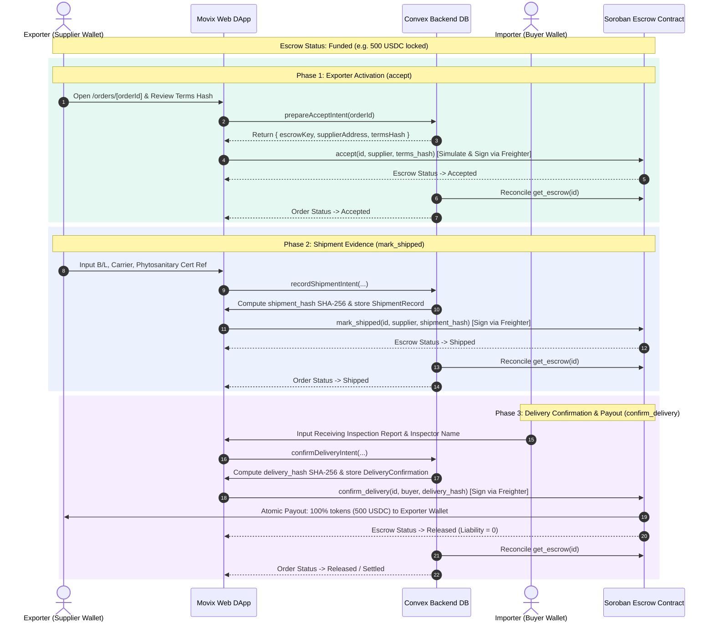

# Movix Sprint 8 - Trade Fulfillment, Delivery Confirmation, and Escrow Release Technical Guide

> **Author**: 📝 Bri (Technical Writer)  
> **Status**: Approved & Verified  
> **Target Environment**: Stellar Testnet (`stellar:testnet`)  
> **Contract Authority**: Escrow v1 Pinned Contract `CCEECHOGV6MXZANAOLJNDMA2GPEBDETPNWUR4XDEW32KHJUYN3V5ZAP5`

---

## 1. Executive Summary

Sprint 8 completes the post-funding lifecycle for ASEAN agricultural trade orders on Movix. An accepted and funded Trade Order transitions seamlessly through verified Exporter contract activation, recorded agricultural shipment evidence (Bill of Lading / Air Waybill, phytosanitary certificate), Importer receiving inspection delivery confirmation, and atomic Soroban token release directly to the Exporter's wallet.

---

## 2. End-to-End Fulfillment Sequence



---

## 3. Off-Chain Evidence Schemas & SHA-256 Hash Derivation

Raw evidence strings (e.g. carrier names, inspection notes) are stored in the Convex database. Only deterministic 32-byte SHA-256 hashes (`BytesN<32>`) are committed to Soroban contract storage.

### 3.1 Agricultural Shipment Evidence Schema (`ShipmentEvidence`)

```typescript
export interface ShipmentEvidence {
  orderId: string;
  revisionId: string;
  carrierName: string;
  trackingOrDocumentNumber: string; // Bill of Lading (B/L) or Air Waybill (AWB)
  phytosanitaryCertNumber?: string;
  portOfLoading: string;
  portOfDischarge: string;
  shippedDate: string; // ISO 8601 YYYY-MM-DD
  vesselOrFlightId?: string;
}
```

- **Hash Formula**: `shipment_hash = SHA-256(UTF8(CanonicalJSON(ShipmentEvidence)))`
- **Determinism**: Keys are sorted alphabetically prior to serialization to ensure cross-platform hash identity.

### 3.2 Importer Receiving Inspection Schema (`DeliveryConfirmation`)

```typescript
export interface DeliveryConfirmation {
  orderId: string;
  revisionId: string;
  receivedDate: string; // ISO 8601 YYYY-MM-DD
  receivingLocation: string;
  inspectionCertificateNumber?: string;
  inspectionResult: "accepted_full" | "accepted_conditional";
  inspectorName: string;
  notes?: string;
}
```

- **Hash Formula**: `delivery_hash = SHA-256(UTF8(CanonicalJSON(DeliveryConfirmation)))`

---

## 4. Soroban Contract Call & Event Reference

### 4.1 Function Signatures

| Method | Caller | Signature | State Change | Payout |
|---|---|---|---|---|
| `accept` | Exporter (`supplier`) | `accept(id: BytesN<32>, supplier: Address, terms_hash: BytesN<32>) -> Escrow` | `Funded` ➔ `Accepted` | 0 |
| `mark_shipped` | Exporter (`supplier`) | `mark_shipped(id: BytesN<32>, supplier: Address, shipment_hash: BytesN<32>) -> Escrow` | `Accepted` ➔ `Shipped` | 0 |
| `confirm_delivery` | Importer (`buyer`) | `confirm_delivery(id: BytesN<32>, buyer: Address, delivery_hash: BytesN<32>) -> Escrow` | `Shipped` ➔ `Released` | 100% to Exporter |

### 4.2 Decoded Soroban Contract Event Topics

1. **Escrow Accepted**: `("escrow", "accepted")` ➔ Payload: `[escrow_id, supplier, terms_hash]`
2. **Escrow Shipped**: `("escrow", "shipped")` ➔ Payload: `[escrow_id, supplier, shipment_hash]`
3. **Escrow Released**: `("escrow", "released")` ➔ Payload: `[escrow_id, buyer, supplier, gross_amount, fee_amount, net_amount]`

---

## 5. Operations & Recovery Runbook

### 5.1 Interrupted Wallet Signing Recovery
If a user closes their browser or encounters network latency immediately after signing a transaction in Freighter:
1. Movix `useTransactionRecovery(pendingTxHash)` polls Horizon RPC (`https://horizon-testnet.stellar.org/transactions/{hash}`).
2. If confirmed on-chain: backend mutation `applyResult` updates trade order status automatically.
3. If unconfirmed after 3 minutes: user is prompted with a clear "Retry Submission" banner without risk of double-funding or double-release.

### 5.2 Testnet Verification Gate
To verify Sprint 8 functionality:
```bash
# 1. Run Stellar client unit tests
pnpm --filter @repo/stellar test

# 2. Run Convex backend integration & authorization tests
pnpm --filter @repo/backend test

# 3. Verify TypeScript build
pnpm typecheck
```
