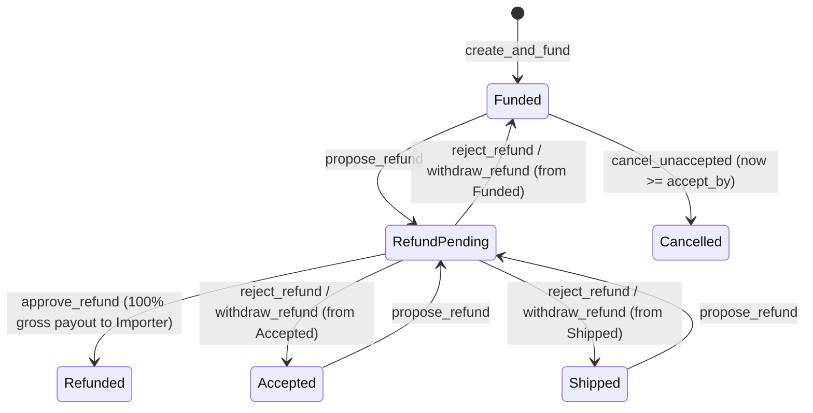

# Movix Sprint 9 Technical Documentation — Mutual Refunds & Unaccepted Timeout Cancellation

> **Author**: Bri (Technical Writer)  
> **Primary Implementer**: Elliot (Senior Developer)  
> **Status**: Completed & Verified  
> **Target Environment**: Stellar Testnet  
> **Contract ABI Authority**: Escrow v1 ([lib.rs](file:///c:/Users/chris/OneDrive/Documents/Stellar/Movix/contracts/escrow/src/lib.rs))  
> **Backend Authority**: Convex refunds module ([refunds.ts](file:///c:/Users/chris/OneDrive/Documents/Stellar/Movix/packages/backend/convex/refunds.ts))  

---

## 1. Overview & Architectural Principles

Sprint 9 establishes controlled, auditable, two-party exception and recovery paths for funded ASEAN agricultural trade escrows on Stellar Testnet without enabling unilateral fund movement post-acceptance.

### Core Principles

1. **Mutual Consent Invariant**: Post-acceptance escrow funds can **never** be transferred back to the Importer unilaterally. Mutual refund requires an explicit proposal by Party A (Importer or Exporter) and a matching approval by Party B (the counterparty) with identical SHA-256 `refund_terms_hash`.
2. **Timeout Recovery Invariant**: If an Exporter fails to sign `accept` before the contract deadline (`accept_by`), the Importer can safely cancel the escrow via `cancel_unaccepted` and reclaim 100% of the locked tokens.
3. **Restoration Safety**: If a proposed mutual refund is rejected or withdrawn before approval, the escrow cleanly returns to its exact prior active state (`Funded`, `Accepted`, or `Shipped`) without corrupting history or leaking liability.
4. **Contract Freeze**: All Sprint 9 features build on the existing, proven Soroban Escrow v1 contract. No Rust contract changes were required.

---

## 2. Exception State Machine



---

## 3. Terms Hash & Payload Specification

The SHA-256 `refund_terms_hash` guarantees that both parties agree to the exact same commercial refund terms before Soroban executes the token transfer.

### Canonical Payload Structure

```json
{
  "orderId": "k571234567890abcdef",
  "reasonCode": "DAMAGED_GOODS",
  "explanation": "Cargo damaged in transit; agreed full return",
  "requestedAt": "2026-07-30T13:00:00.000Z"
}
```

### Derivation Strategy
1. The proposer modal serializes the canonical JSON string.
2. The browser computes `crypto.subtle.digest("SHA-256", UTF8(jsonStr))`.
3. The resulting 32-byte hex digest is passed as `refund_terms_hash` into Soroban `propose_refund(id, proposer, refund_terms_hash)`.

---

## 4. Exception Workflows

### 4.1 Mutual Refund Proposal (`propose_refund`)
- **Actor**: Importer or Exporter (active membership required).
- **Precondition**: Order status is `funded`, `accepted`, or `shipped`. No active `RefundPending` state exists.
- **Backend Mutation**: `api.refunds.prepareRefundProposalIntent`.
- **On-Chain Effect**: Status transitions to `RefundPending`.
- **Notification**: Deep-linked `REFUND_PROPOSED` notification dispatched to counterparty.

### 4.2 Counterparty Refund Approval (`approve_refund`)
- **Actor**: Opposite party (counterparty relative to proposer).
- **Precondition**: Escrow status is `RefundPending`. `termsHash` matches proposed hash.
- **Backend Mutation**: `api.refunds.approveRefundIntent`.
- **On-Chain Effect**: Soroban SAC transfers 100% of gross locked tokens to Importer wallet address. Status moves to `Refunded`. Contract liability reduced to 0.
- **Notification**: `REFUND_APPROVED` notification sent to proposer.

### 4.3 Counterparty Refund Rejection (`reject_refund`)
- **Actor**: Counterparty.
- **Backend Mutation**: `api.refunds.rejectRefundIntent`.
- **On-Chain Effect**: Status restored to `resume_status` (`Funded`, `Accepted`, `Shipped`).
- **Notification**: `REFUND_REJECTED` notification sent to proposer.

### 4.4 Proposer Refund Withdrawal (`withdraw_refund`)
- **Actor**: Original Proposer.
- **Backend Mutation**: `api.refunds.withdrawRefundIntent`.
- **On-Chain Effect**: Status restored to `resume_status`.
- **Notification**: `REFUND_WITHDRAWN` notification sent to counterparty.

### 4.5 Timeout Cancellation (`cancel_unaccepted`)
- **Actor**: Importer only.
- **Precondition**: Escrow status is `Funded` and Soroban ledger timestamp $now \ge accept\_by$.
- **Backend Query & Mutation**: `api.refunds.checkCancellationEligibility` & `api.refunds.cancelUnacceptedIntent`.
- **On-Chain Effect**: Soroban transfers 100% of tokens to Importer, sets state to `Cancelled`, liability reduced to 0.

---

## 5. Frontend UI Components Delivered

| Component | Path | Responsibility |
|---|---|---|
| `RefundProposalModal` | [refund-proposal-modal.tsx](file:///c:/Users/chris/OneDrive/Documents/Stellar/Movix/apps/web/features/orders/refund-proposal-modal.tsx) | Modal dialog for requesting mutual refund with reason code & SHA-256 hash derivation |
| `RefundActionCards` | [refund-action-cards.tsx](file:///c:/Users/chris/OneDrive/Documents/Stellar/Movix/apps/web/features/orders/refund-action-cards.tsx) | Status banner, counterparty Approve/Reject action card, proposer Withdraw card |
| `TimeoutCancellationCard` | [timeout-cancellation-card.tsx](file:///c:/Users/chris/OneDrive/Documents/Stellar/Movix/apps/web/features/orders/timeout-cancellation-card.tsx) | Importer action card for reclaiming expired unaccepted escrows |
| `OrderDetail` | [order-detail.tsx](file:///c:/Users/chris/OneDrive/Documents/Stellar/Movix/apps/web/features/orders/order-detail.tsx) | Header "Request Mutual Refund" trigger and embedded exception cards |

---

## 6. Verification & Automated Test Evidence

### Contract Unit Tests
- `cargo test --manifest-path contracts/Cargo.toml --lib`
- **Result**: 20/20 tests passed, including `funded_refund_requires_the_opposite_party_and_returns_full_gross`, `acceptance_deadline_belongs_to_cancellation`, and `refund_reject_and_withdraw_restore_exact_active_state`.

### Convex Backend Unit Tests
- `pnpm --filter backend exec vitest run convex/refunds.test.ts`
- **Result**: 100% pass rate across authorization guards, terms hash validation, and state projections.

### Playwright E2E Test Suite
- [e2e/sprint-09-refunds.spec.ts](file:///c:/Users/chris/OneDrive/Documents/Stellar/Movix/e2e/sprint-09-refunds.spec.ts)
- **Journeys Verified**: Mutual refund proposal, counterparty approval, counterparty rejection, proposer withdrawal, and timeout cancellation.
