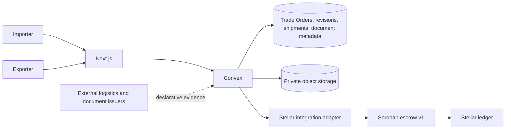

# Agricultural Trade Architecture and Sprint 6 Migration

> Status: Implemented in development; release sign-off pending  
> Product terminology: ASEAN agricultural trade  
> Legacy identifiers: Preserved during the Sprint 6 compatibility migration  
> Last reviewed: July 29, 2026

## 1. Architectural decision

The pivot changes the off-chain domain, presentation, and release gates. It does not require a new application architecture or Soroban contract.

Keep:

- Next.js, Convex, `packages/domain`, `packages/stellar`, and `packages/ui`;
- SEP-10 authentication and server-derived organization authorization;
- current tables, record IDs, module paths, routes, and API functions during compatibility;
- immutable order revisions, deterministic terms hashes, decisions, notifications, and timelines;
- Soroban escrow v1 ABI, liabilities, solvency, authorization, refund, cancellation, and one-shipment/full-release behavior.

Add:

- canonical Trade Order views and importer/exporter display adapters;
- agricultural revision fields and `order-terms-v2`;
- organization verification and real Exporter invitation completion;
- independent Shipment and Trade Document domains;
- additive API aliases and migration telemetry;
- reconciliation and release-readiness evidence.

## 2. Authority boundaries

| Concern | Authority |
|---|---|
| Trade Order negotiation, revisions, commodity terms | Convex |
| Organization verification and roles | Convex |
| Shipment operational state | Convex |
| Required-document checklist and metadata | Convex |
| Confidential document bytes | Private object storage |
| Escrow balance and settlement state | Soroban |
| Displayed chain projection | Convex, reconciled from Soroban getters/events |
| Customs, quality, certificate, or sanctions truth | External authority; never inferred by Movix |

Trade Order, Shipment, and Escrow remain separate state machines.

## 3. Contract compatibility

No Sprint 6 ABI or WASM change is required.

| Escrow v1 identifier | Agricultural meaning |
|---|---|
| `buyer` | Importer |
| `supplier` | Exporter |
| `terms_hash` | Hash of the accepted Trade Order revision |
| `shipment_hash` | Hash of the dispatch evidence manifest |
| `delivery_hash` | Hash of the delivery confirmation manifest |
| `accept` | Exporter activates/acknowledges the funded escrow |

Off-chain Exporter acceptance agrees to commercial terms. Contract `accept` remains a later authorization acknowledging the funded escrow. The implemented application adapter exposes `activateEscrow` while calling the unchanged generated contract method.

Operational states such as booked, in transit, customs processing, and arrived remain off-chain. Only dispatch maps to `mark_shipped`; only Importer Delivery Confirmation maps to `confirm_delivery`.

Agricultural fields and document URLs must not be stored on-chain. The contract requires opaque commitments, not commercially sensitive or jurisdiction-variable data.

## 4. Hashing and documents

New agricultural revisions use `TradeTermsSnapshotV2` with explicit schema version and deterministic UTF-8 canonicalization. It includes parties, accounts, asset/amount, commercial dates and deadlines, commodity lines, exact quantity/UOM, unit price, discount, tax, calculated line amounts and totals, origin/destination, shipment/arrival windows, Incoterm edition/rule/place, required document types, release conditions, and revision number.

It excludes internal notes, current shipment status, signed URLs, and documents uploaded after acceptance unless their required type or exact digest is explicitly part of the accepted commercial terms.

Rules:

- never recompute an `order-terms-v1` hash;
- a material edit creates v2 revision N+1 and invalidates current acceptance;
- a funded revision cannot be mutated;
- a funded amendment uses the existing refund/cancellation path and a newly accepted revision;
- TypeScript and integration code share golden hash fixtures.

Document bytes use private object storage. Convex stores immutable versions with object key, digest, MIME/size, uploader/issuer, access scope, issue/expiry dates, malware state, and audit metadata. Downloads require short-lived signed URLs after organization authorization. Evidence manifests bind the Trade Order ID, revision, escrow ID, contract, and network to prevent replay.

## 5. Compatibility API

Current functions remain authoritative implementation targets in Sprint 6. Canonical aliases delegate without copying logic.

| Canonical surface | Compatibility implementation |
|---|---|
| `tradeOrders:*` | `orders:*` and `orderDrafts:*` |
| `exporterDirectory:*` | `supplierDirectory:*` |
| `exporterOrders:*` | `supplierOrders:*` |
| Displayed Importer/Exporter side | web adapter over compatible `viewerSide: "buyer" | "supplier"` |
| `/trade-orders` | implemented redirect/alias to `/orders` |
| `/importer`, `/exporter` | implemented redirects to `/buyer`, `/supplier` |

Existing routes, tables, indexes, technical roles, functions, contract symbols, historical fixtures, and evidence are not renamed in Sprint 6. Removal requires two stable releases, zero observed legacy callers, complete reconciliation, no active legacy drafts, and an approved rollback plan.

## 6. UX migration

Preserve the visual system, app shell, cards, tables, dialogs, and route composition. Change active labels, metadata, forms, validation, states, and accessibility names.

Visible navigation:

- Dashboard
- Trade Orders
- Create Trade Order
- Trade Documents
- Organization Settings
- Verification

For organizations with both capabilities, use “Created by us” and “Received from counterparties” tabs rather than duplicating the application shell.

Trade Order form additions:

- Commodity name/category and optional description/grade/variety
- Exact quantity and controlled UOM
- Origin and destination country
- Planned shipment and expected arrival windows
- Optional Incoterm edition/rule; named place required when selected
- Optional document requirements and attachments

The detail page shows separate Trade Agreement, Escrow, Shipment, and Trade Document sections. Each pending state names the next actor. Verification has not-started, pending, verified, and action-required states with an explanation and recovery link for every blocked action.

## 7. Widen–migrate–narrow task list

| ID | Task | Primary files | Exit evidence |
|---|---|---|---|
| S6-MIG-01 | Freeze API, route, model, hash, and escrow ABI compatibility snapshots | `packages/domain`, Convex validators, `contracts/escrow` | Sprint 0–5 tests pass; ABI has no removals |
| S6-MIG-02 | Widen organization and order domain with verification and agricultural fields | `packages/domain/src/business.ts`, `orders.ts`, `lifecycles.ts` | Legacy records deserialize; exact quantity tests pass |
| S6-MIG-03 | Add versioned Trade Document metadata and access-control APIs | `schema.ts`, new `tradeDocuments.ts`, detail/timeline | Cross-tenant denial and immutable-version tests pass |
| S6-MIG-04 | Add `order-terms-v2` while preserving v1 | domain hashing, validators, drafts, revisions, decisions | Golden hashes and stale-acceptance tests pass |
| S6-MIG-05 | Widen Convex schema and add thin canonical API aliases | schema, validators, order/onboarding modules | Old/new API parity and authorization tests pass |
| S6-MIG-06 | Run resumable migration and exact count reconciliation | `migrations.ts` | Second run performs zero writes; IDs/hashes/history unchanged |
| S6-MIG-07 | Apply minimal frontend terminology, form, verification, and document changes | `apps/web/app`, `features` | Deep links survive; no active legacy wording; a11y passes |
| S6-MIG-08 | Add escrow semantic adapter and evidence-manifest commitments | `packages/stellar`; contract tests only | No ABI/WASM change; v1 lifecycle regression passes |
| S6-MIG-09 | Complete E2E, concurrency, security, migration, and release evidence | `e2e`, test suites, evidence manifest | Authenticated two-party QA journey and sign-off |

### Migration rules

1. Add fields as optional.
2. Mark historical hashes `order-terms-v1`.
3. Mark unmigrated pre-pivot drafts `legacy_incomplete`.
4. Never invent commodity, origin, destination, verification, or compliance data.
5. Completed/cancelled v1 records remain readable and immutable.
6. Funded/in-flight v1 records continue under v1.
7. A new or amended Trade Order requires complete v2 terms and renewed acceptance.
8. Reconcile `before = migrated + skipped + failed` by table and lifecycle state.
9. Report actionable failures without deleting records.
10. Narrow only after the compatibility-removal gate is approved.

### Development migration result

The Convex development deployment was updated on July 29, 2026 at 18:54 Asia/Manila.

- 8 orders and 8 revisions were scanned and processed.
- 7 legacy records were tagged and 1 existing v2 record remained unchanged.
- No missing-current-revision or orphan-revision failure was found.
- The supplier-queue backfill processed 8 orders and restored the sent order to `requires_decision`.
- Second runner calls returned `Migration already done`.
- Post-migration preview reported `wouldWrite: false` for all 8 records.

This proves the development migration only. Every later target deployment still requires its own inventory, dry run, application, second-pass proof, and reconciliation artifact.

For Sprint 6, “dry run” means the side-effect-free `sprint6MigrationInventory` and `sprint6RevisionMigrationInventory` preview queries. The migrations library's `dryRun` runner hit BigInt JSON serialization, so it was not used as evidence.

## 8. Security and operational gates

Test:

- cross-organization Trade Order and document denial;
- signed-URL expiry and membership revocation;
- malware/digest mismatch and evidence replay;
- concurrent edit/accept, accept/reject, document replacement, and migration rerun;
- stale accepted revision funding;
- exact quantity, UOM, asset, and fee precision;
- projection reconciliation against Soroban;
- wallet rejection, wrong network, delayed finality, and refresh recovery;
- keyboard, screen-reader, responsive, and error-state behavior.

Sprint 6 contract release verification passed without redeployment:

- source commit: `a9d09f9bf4890d6093803be6d1a62fe5d460a2b2`;
- release WASM SHA-256: `a6c938a6148a7fd0cc768eee25088ef66822243c05e71516e1400d9bc18bd498`;
- generated bindings SHA-256: `066d15c46562c1ca29630ae59615eb3ac6f29cd058bf7b95852ef09b43930cf8`; and
- Testnet contract ID: `CCEECHOGV6MXZANAOLJNDMA2GPEBDETPNWUR4XDEW32KHJUYN3V5ZAP5`.

Contract source, ABI, WASM, and generated bindings were unchanged, so no deployment or escrow migration was required. Transaction projection/smoke evidence still requires approved Testnet identities and remains a release gate.
