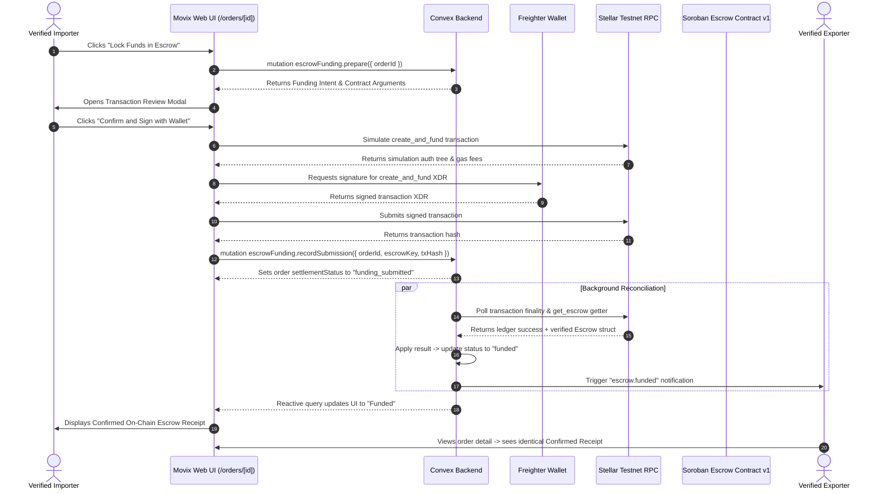
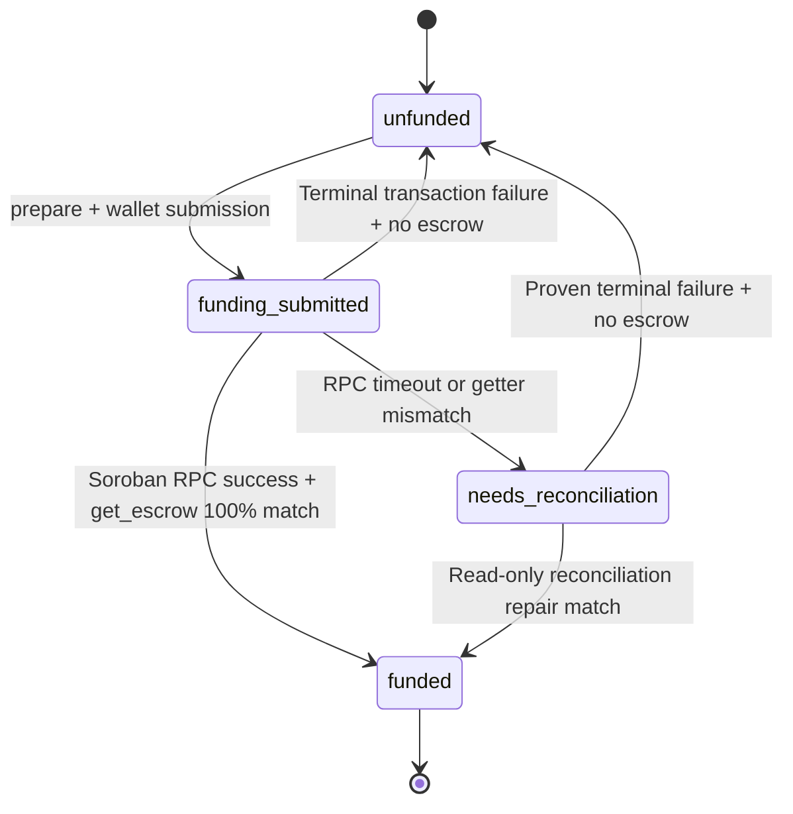

# Escrow Funding Architecture & Sequence Diagrams

This document illustrates the end-to-end multi-party interaction and sequence of events for locking trade funds in escrow on Stellar Testnet.

## 1. End-to-End Sequence Flow

## 2. Settlement Projection State Machine

