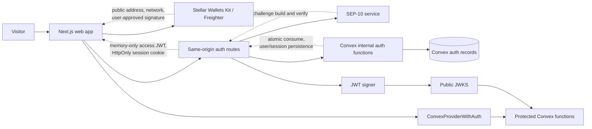
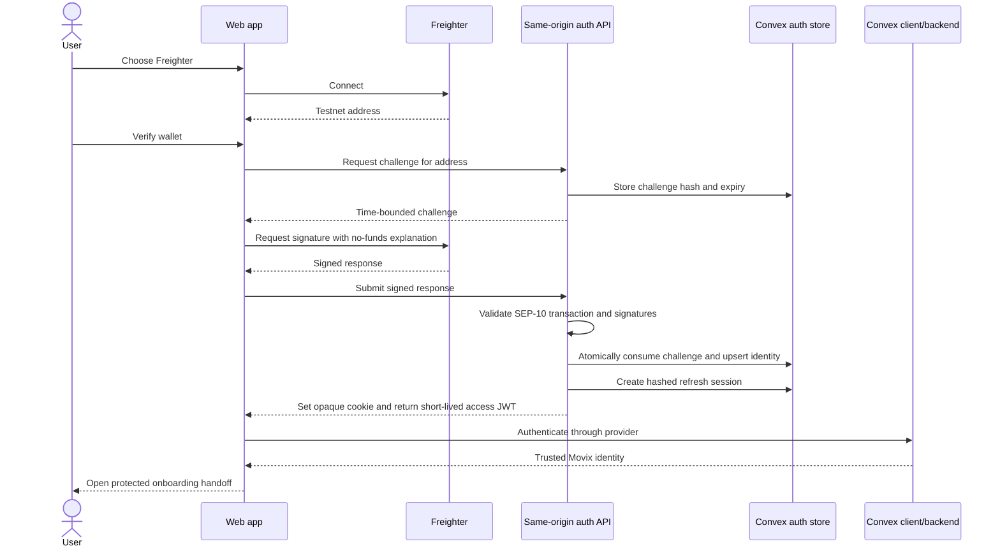
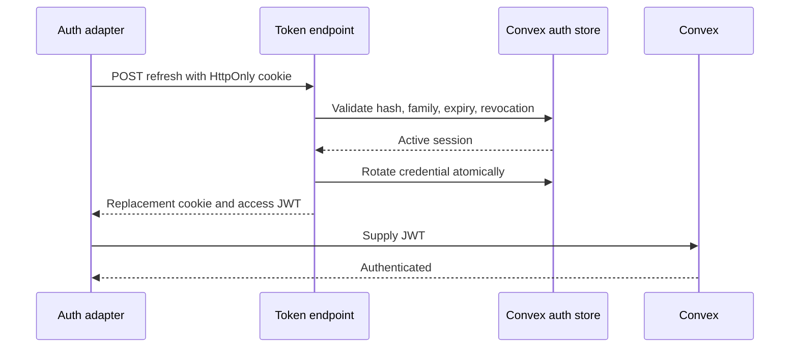

# Sprint 1 Authentication Architecture

## Purpose and audience

This document explains the Sprint 1 authentication boundary for web, backend, security, QA, and future Sprint 2 maintainers. It describes intended behavior; the [evidence checklist](testing-and-evidence.md) records what has actually been demonstrated.

## Trust boundaries

Sprint 1 has four distinct states:

1. **Wallet connected:** the browser can read a selected public address and network.
2. **Wallet control verified:** the server has validated a signed, one-time SEP-10 challenge.
3. **Movix session established:** the server has created a rotating browser session and issued a short-lived application JWT.
4. **Convex identity accepted:** Convex has verified the JWT and a protected function can map the trusted identity to an active Movix user.

None of these states grants organization membership, buyer/supplier capability, or permission to move funds. Those authorization decisions begin in Sprint 2.

Server-only boundaries contain the SEP-10 signing secret, JWT private key, challenge consumption, user/wallet upsert, refresh-session rotation, and token issuance. Public endpoints expose only public metadata, categorized errors, and the minimum response needed by the client.

## First sign-in

The UI reaches `authenticated` only after Convex confirms authentication. Receiving a wallet signature or an API success response alone is insufficient.

## Returning session and refresh

The browser does not persist the access JWT. On return, the auth adapter calls `POST /api/auth/token` with the HttpOnly session cookie. The server validates and rotates the session credential, detects reuse of superseded credentials, and returns a new short-lived JWT. Concurrent client refresh requests are deduplicated so ordinary Convex traffic cannot resemble credential reuse.

Missing, expired, revoked, or reused credentials clear browser authentication and return the user to `/login` with a safe explanation.

## Logout

Logout revokes the current session idempotently, clears the cookie, clears the in-memory access token, and removes Convex authentication. Wallet disconnection is separate cleanup: logout succeeds even if Freighter cannot disconnect.

## Wallet or network change

The orchestration layer snapshots the connected address and network for each attempt. Any change:

- invalidates the pending challenge and late callbacks;
- clears authenticated state for a different wallet/network;
- blocks non-Testnet networks;
- requires a fresh challenge before another signature.

Raw challenge material is never restored from browser storage after a reload.

## Persistence and identity

`authChallenges` holds a unique challenge hash, normalized Testnet account, domains, time bounds, use/supersession state, categorized result, and privacy-safe correlation identifier. Consumption and successful identity/session creation must allow at most one winner under concurrent replay.

`authSessions` holds only a hash of the opaque credential, its family and rotation links, the user and verified wallet, expiry/revocation state, and key identifier. Raw credentials are never stored.

The JWT `sub` is the stable internal Movix user identifier. Convex verifies the issuer, audience, signature, algorithm, key, and time claims before exposing identity. Authorization helpers derive identity from `ctx.auth`, reject null identities, and resolve the trusted provider identity to an active user and verified Testnet wallet.

## Security invariants

- Testnet and standard `G...` accounts only.
- The SEP-10 Stellar key and application JWT key are separate.
- Challenges are sequence `0`, nonce-bearing, time-bounded, server-signed, one-time-use, and domain-bound.
- Access JWTs are short-lived, signed with the configured key, and held in memory.
- Refresh credentials are opaque, rotating, HttpOnly, hashed at rest, and family-revocable.
- Authentication responses are same-origin, non-cacheable, size-limited where applicable, and rate-limited by operation.
- Logs never contain keys, secrets, credentials, JWTs, or raw/signed authentication transactions.

## Maintenance triggers

Update this document when the login state machine, trust boundary, endpoint ownership, provider integration, identity mapping, persistence model, wallet/network support, or refresh/logout behavior changes. Fixed decisions require a new or superseding ADR.
