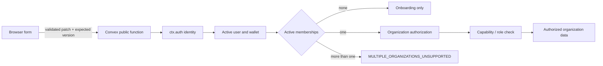
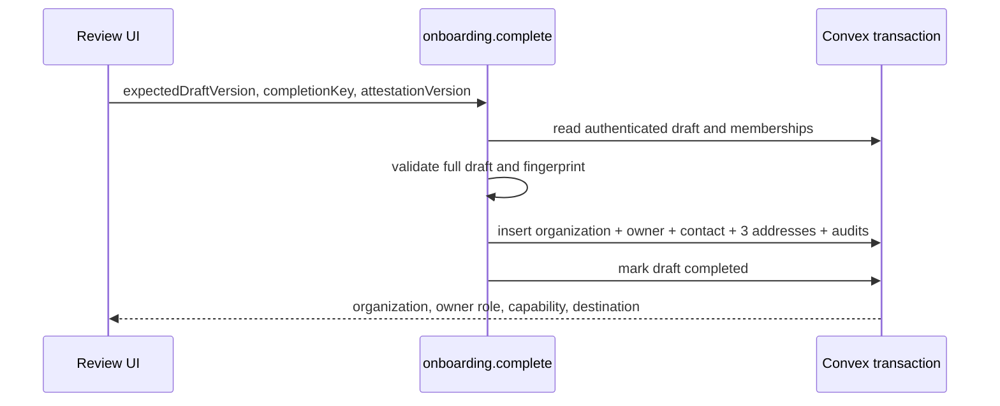

# Business Onboarding Architecture

## Trust boundary

The browser supplies business input and optimistic versions. It never supplies a user identity, membership, role, organization status, verification state, or authorization decision. Every protected Convex function derives the principal from `ctx.auth`, resolves the active user and session family, then independently checks membership and organization state.

## Atomic onboarding completion

Draft completion is a single Convex mutation. It revalidates the entire saved draft and attestation version, checks membership and duplicate-registration constraints, and writes the organization, owner membership, primary contact, three explicit addresses, completion marker, and two audit events in one transaction. A failed check or write leaves no partial organization.

Convex optimistic concurrency control serializes competing completions. A retry with the same completed draft and key returns the recorded result; a different key receives `ONBOARDING_ALREADY_COMPLETED`.

## Migration strategy

The checked-in schema is the widen phase: canonical fields coexist with legacy optional fields and legacy enum values. New writes use only the canonical format. The stateful migrations are resumable and support dry runs.

Before any deployment:

1. inventory the environment without exporting records;
2. use the canonical schema directly when no legacy records exist;
3. otherwise deploy the widen phase;
4. dry-run, execute, and verify the migrations;
5. narrow only after all documents conform.

Only derivable values are backfilled. Missing email, country, tax, address, or attestation values remain missing and therefore not ready.

## Routing and invalidation

`organizations.currentContext()` is the only server-derived UX routing source. No membership routes to onboarding. One active organization routes to an allowed workspace, with dual capability defaulting to buyer. Multiple active memberships route to an explicit unsupported state. The shell unmounts protected content while context is loading or invalid.

Backend authorization remains independent of route policy. Guessing or retaining a foreign organization or child identifier cannot cross the organization boundary.

### Shell and settings presentation

The desktop shell supports expanded and collapsed icon-navigation states. Expanded
mode centers the Movix brand and organization/wallet identity. Collapsed mode hides
the organization/wallet text and centers the compact logo and navigation icons;
icons retain accessible names when labels are visually hidden. Collapse state is
presentation only and never changes organization, capability, route authorization,
or backend context. Tablet and mobile continue to use the existing modal Sheet and
focus-restoration behavior.

Business settings use tabs to present identity, contact, and address sections without
changing the section-scoped APIs, optimistic versions, validation, or audit rules.
Onboarding native selects define explicit foreground/background contrast, and
labels maintain 12 px separation from their controls.

## Sprint 3 guarantees

Sprint 3 may rely on stable organization IDs, exactly one active owner membership for newly onboarded businesses, explicit canonical addresses, capability-derived views, structured readiness, versioned mutable records, and field-name-only audits. It must not assume production verification, multi-organization selection, persisted view preference, or completed optional/P1 business defaults.
