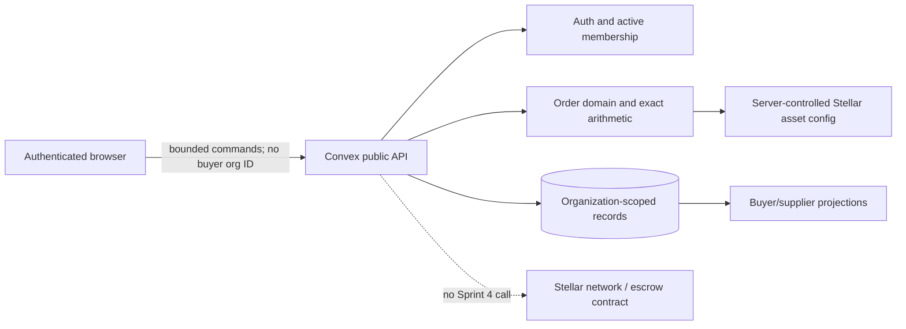
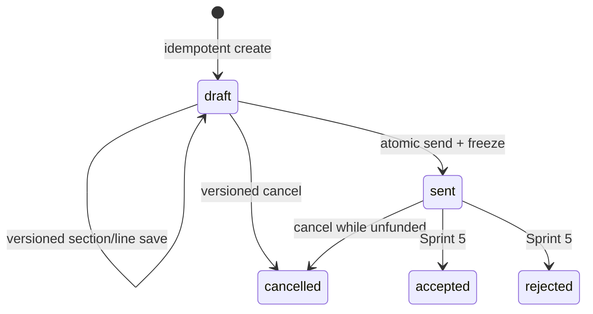
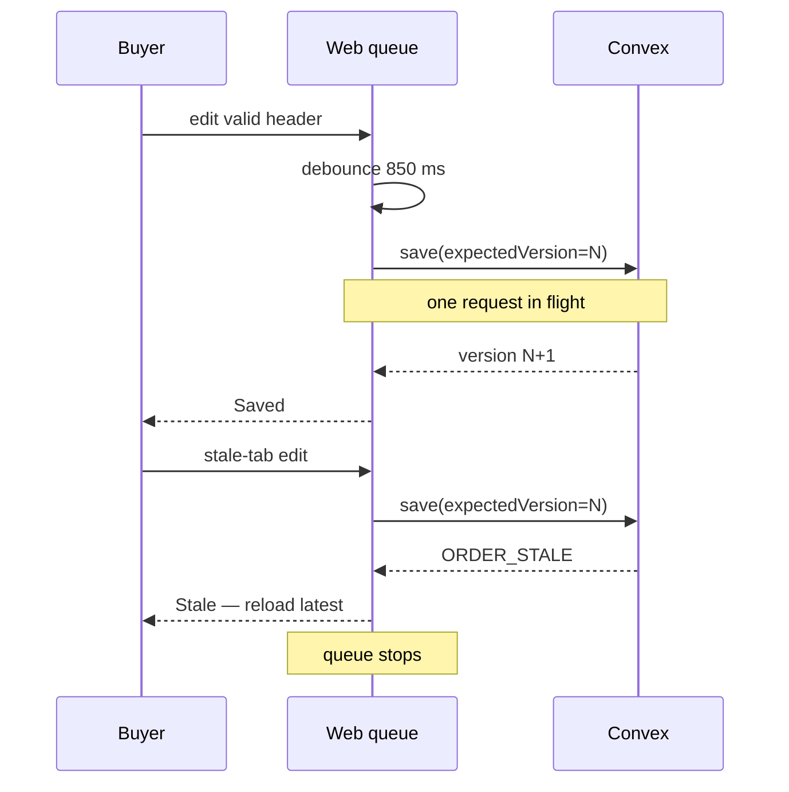
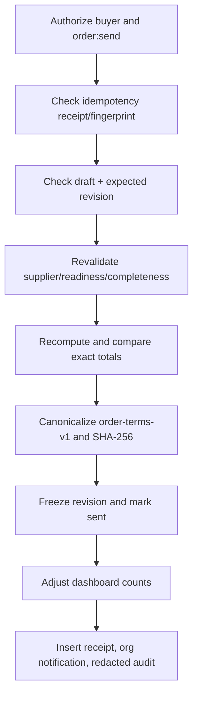
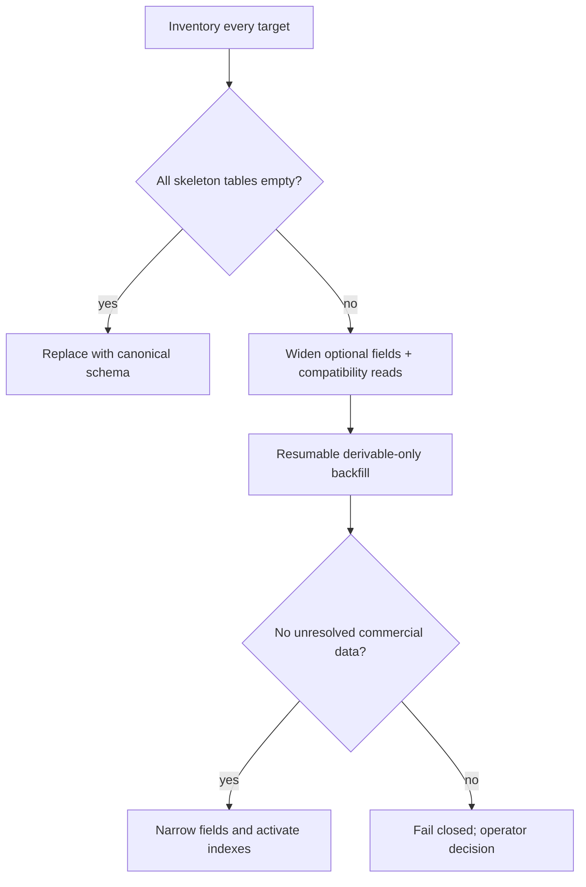

# Buyer procurement architecture

Status: implemented for Sprint 4  
Scope authority: [Sprint 4 detailed specification](../Movix-Sprint-04-Buyer-Procurement-Detailed.md)

## Boundaries

Sprint 4 is an off-chain buyer-to-sent-order slice. Convex owns identity, the sole active organization context, supplier eligibility, drafts, exact totals, immutable revisions, command receipts, notifications, counters, and audit events. The browser owns transient form state only. Stellar configuration resolves Testnet XLM and USDC metadata on the server; there is no transaction build, signature, wallet prompt, escrow call, or contract mutation.

Every order read derives the active buyer organization from `ctx.auth`. Unknown and foreign IDs return the same `ORDER_NOT_FOUND` denial. Supplier lookup is exact; it is not a browseable directory.

## Components and flow

- `@repo/domain/orders` owns normalization, checked integer arithmetic, display formatting, and `order-terms-v1` bytes.
- `packages/backend/convex/orderDrafts.ts` owns mutable revision 1 and line commands.
- `packages/backend/convex/orders.ts` owns list, detail, atomic send, and cancellation.
- `supplierDirectory.ts`, `orderAuthorization.ts`, and `orderAssets.ts` enforce trust boundaries.
- `apps/web/features/orders` owns buyer views and autosave orchestration. Route files remain compositional.

Agreement, fulfillment, and settlement are separate state dimensions. Sprint 4 changes only agreement state and requires settlement to remain `unfunded`.

## Autosave concurrency

Draft identity is preserved in the URL (`/orders/new?orderId=…`) for refresh recovery. Commercial content is never placed in local storage.

## Atomic send

These steps execute in one Convex mutation. Failed validation rolls back the transaction. Replays with the same key and fingerprint return the recorded result; conflicting reuse fails.

## Migration branch

The configured development deployment was inventoried before rollout. `relationships`, `orders`, `orderRevisions`, and `orderLines` contained zero rows, so the direct canonical replacement branch was used.

Any other deployment must repeat inventory. The empty-development result must not be assumed elsewhere.

## Sprint 5 handoff

Sprint 5 may expose supplier organization notifications through active membership, accept/reject a frozen revision, and introduce funding. It must reuse the stored revision and terms hash. It must not select an arbitrary supplier user, rewrite Sprint 4 snapshots, or treat a notification as authorization.
