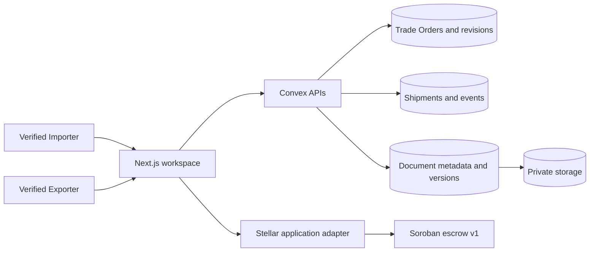

# Sprint 6 Implementation Guide

> Status: Engineering implementation complete in development; release sign-off pending  
> Scope: ASEAN agricultural Trade Orders on Stellar Testnet  
> Last verified: July 29, 2026

## Outcome

Sprint 6 adds an agricultural Trade Order model, verified-counterparty workflow, immutable document versions, and an independent Shipment lifecycle without replacing the Sprint 0–5 order or escrow foundations.

The compatibility boundary is intentional:

- Convex remains authoritative for organizations, Trade Agreements, revisions, decisions, Shipments, and Trade Document metadata.
- Private Convex storage holds document bytes.
- Soroban escrow v1 remains authoritative for funds and settlement.
- Trade Agreement, Escrow, Shipment Status, and Trade Documents are separate states in both code and the detail UI.
- Legacy routes, Convex functions, stored identifiers, v1 hashes, and historical records remain readable.



## Implementation map

| Layer | Implementation |
|---|---|
| Domain | `packages/domain/src/orders.ts` defines and validates deterministic `order-terms-v2` snapshots while leaving v1 canonicalization intact. |
| Convex schema | `packages/backend/convex/schema.ts` widens organizations, orders, revisions, lines, and Shipments and adds verification, invitation, document-version, shipment-event, and migration-failure tables. |
| Convex behavior | Verification, invitations, agricultural terms, decisions, revisioning, Shipments, and Trade Documents are server-authorized and version checked. |
| Canonical API aliases | `tradeOrders`, `exporterDirectory`, `exporterOrders`, `tradeOrderDecisions`, and `tradeOrderRevisions` delegate to the existing implementation modules. |
| Web | The workspace uses Importer/Exporter/Trade Order terminology, creates v2 agricultural drafts, exposes verification and invitation screens, preserves legacy deep links, and separates the four operational states on Trade Order detail. |
| Stellar adapter | `activateEscrow` names the agricultural application action while calling the unchanged generated escrow-v1 `accept` method. Evidence-manifest hashing binds off-chain evidence to the exact order, revision, escrow, contract, and network. |

## Data model

Sprint 6 uses additive fields so existing Convex documents continue to deserialize.

| Record | Sprint 6 fields or behavior |
|---|---|
| `organizations` | Canonical verification status and optional current `verificationCaseId`. |
| `organizationVerificationCases` | Evidence digest/reference, submitter, reviewer, reason/recovery data, timestamps, and optimistic version. |
| `exporterInvitations` | Importer, intended Exporter/email/wallet, hashed single-use token, expiry, lifecycle status, acceptance identity, and resulting relationship. |
| `orders` | Optional `migrationState`, existing agreement/fulfillment/settlement states, and current/accepted revision identities. |
| `orderRevisions` | Party wallet snapshots, destination, shipment and arrival windows, Incoterms 2020 fields, required document types, `termsHashVersion`, and `migrationState`. |
| `orderLines` | Category, grade/variety, specification, origin country, packaging, exact coefficient/scale quantity, and controlled UOM. |
| `shipments` | One Shipment per Trade Order, accepted revision identity, route/windows, carrier/tracking metadata, state, evidence digest, and version. |
| `shipmentEvents` | Append-only actor, state, evidence digest, note, and occurrence time. |
| `tradeDocuments` | Trade Order and party scope, normalized type, visibility, current immutable version, and optimistic version. |
| `tradeDocumentVersions` | Storage identity, SHA-256 digest, MIME/size, uploader/issuer, issue/expiry dates, visibility, scan/review state, and superseded version. |
| `migrationFailureReports` | A safe place for migration name, table, document identifier, code, and redacted details. |

### Trade Order terms v2

`TradeTermsSnapshotV2` commits to:

- revision number;
- Importer and Exporter organization snapshots;
- Importer and Exporter wallet snapshots;
- Testnet asset identity, decimals, and total base units;
- order, issue, requested-delivery, acceptance-deadline, funding-deadline, and optional validity dates;
- each commodity line's number, name, category, grade/variety, specification, exact decimal quantity, controlled UOM, origin country, unit price, discount, tax, and calculated amounts;
- subtotal, discount, tax, shipping, and grand totals;
- destination country;
- planned shipment and expected arrival windows;
- optional Incoterms 2020 rule and named place;
- sorted required document types; and
- release-condition strings derived from payment mode, automatic-release policy, refund policy, and inspection period.

The canonicalizer normalizes text, sorts object keys, sorts commodity lines by line number, sorts document/release-condition sets, serializes integers without JavaScript-number loss, and prefixes the payload with `MOVIX_ORDER_TERMS_V2`. SHA-256 produces the stored terms hash.

Quantities retain the existing integer coefficient plus scale representation, with at most six decimal places. V2 accepts the controlled UOM set `KG`, `MT`, `T`, `LB`, `L`, `M3`, `BAG`, `BOX`, and `EA`. Country fields use ISO alpha-2 codes. Supported Incoterms are the 11 Incoterms 2020 rules, and a named place is required when an Incoterm is selected.

## API surface

### Compatibility aliases

| Canonical API | Delegates to |
|---|---|
| `tradeOrders.createDraft` | `orderDrafts.create` |
| `tradeOrders.getDraft` | `orderDrafts.get` |
| `tradeOrders.saveTradeTerms` | `orderDrafts.saveAgriculturalTerms` |
| `tradeOrders.getReview` | `orderDrafts.getReview` |
| `tradeOrders.send` | `orders.send` |
| `tradeOrders.get` | `orderDetails.get` |
| `exporterDirectory.resolve` | `supplierDirectory.resolveExact` |
| `exporterOrders.getSummary`, `exporterOrders.list` | `supplierOrders` equivalents |
| `tradeOrderDecisions.accept`, `tradeOrderDecisions.reject` | `orderDecisions` equivalents |
| `tradeOrderRevisions.startFromCurrent` | `orderRevisions.startFromCurrent` |

The aliases are re-exports. They do not duplicate authorization, hashing, idempotency, or state-transition logic.

### New Sprint 6 modules

| Module | Public operations |
|---|---|
| `organizationVerification` | `current`, `submit`; `review` is internal-only. |
| `exporterInvitations` | `issue`, `getByToken`, `accept`, `revoke`. |
| `tradeDocuments` | `createUpload`, `replace`, `completeUpload`, `list`, `createDownloadUrl`, `review`; `markScanResult` is internal-only. |
| `shipments` | `create`, `recordStatus`, `get`. |
| `migrations` | `backfillSprint6Orders`, `backfillSprint6OrderRevisions`, `sprint6MigrationInventory`, and the existing migrations runner. |

## End-to-end behavior

### 1. Organization verification

The public statuses are `not_started`, `pending`, `verified`, and `action_required`. Historical `unverified` maps to `not_started`; historical `rejected` maps to `action_required`.

An organization owner or other member with `organization:edit` submits a 64-character lowercase SHA-256 evidence digest and an optional private evidence reference. Submission checks the expected organization version, creates an auditable case, and moves the organization to `pending`. Only the internal operator mutation can review a pending case. Review checks the case version and current organization/case link before setting `verified` or `action_required`; the latter requires a reason code and may include a recovery URL.

Read-only authorized views remain available to an unverified organization. Consequential actions fail closed until verification:

- issuing or accepting an Exporter invitation;
- issuing a Trade Order;
- accepting or rejecting a Trade Order revision;
- creating, replacing, or reviewing a Trade Document version; and
- creating or changing a Shipment.

The settings UI keeps organization verification distinct from wallet authentication and presents pending and recovery states.

### 2. Intended Exporter invitations

A verified Importer can issue an invitation targeted by Exporter organization, business email, wallet, or a combination. The invitation must live for more than one minute and no more than 30 days. The raw token is returned only at issuance; Convex stores its SHA-256 hash.

Acceptance requires one active, verified Exporter organization. Every supplied target must match that organization or its authenticated wallet. The server rejects self-dealing, duplicate active invitations, wrong organizations, expired tokens, revoked tokens, and token reuse with stable error codes. Successful acceptance activates or creates the exact Importer–Exporter relationship and records an audit event.

The invitation page supports both issuance and token acceptance. It also states the product boundary: Movix binds known counterparties and does not provide counterparty discovery.

### 3. Create, issue, decide, and revise

The web creation flow starts new work with `termsHashVersion: "order-terms-v2"` and collects:

1. intended Exporter;
2. Trade Order header and deadlines;
3. agricultural commodity lines;
4. commercial terms, route/windows, Incoterm, and required documents; and
5. a review of the exact snapshot and blockers.

Issuing a Trade Order:

1. authenticates the Importer and checks `order:send`;
2. requires both Importer and resolved Exporter organizations to be verified;
3. checks optimistic version and idempotency identity;
4. rejects incomplete or `legacy_incomplete` terms;
5. recomputes stored totals;
6. hashes the correct v1 or v2 canonical form;
7. freezes the revision; and
8. queues the exact revision for the Exporter decision.

Exporter acceptance/rejection checks the order ID, revision ID, order version, revision version, expected terms hash, decision deadline, queue state, idempotency key, and absence of a prior decision for the revision. Acceptance is an immutable off-chain Trade Agreement decision; it moves no funds.

Starting revision N+1 copies the frozen commercial snapshot and lines, marks the old revision as superseded, makes the order a draft, clears the accepted revision and decision identities, and resets the Exporter queue. Every new revision is v2. If copied legacy facts cannot complete v2, it remains `legacy_incomplete` until the Importer supplies the missing facts. Any material edit changes the v2 hash and therefore requires the Exporter to accept N+1.

### 4. Trade Documents

Document bytes never enter order terms or the chain. The workflow is:

1. a verified participant requests an upload URL;
2. the browser uploads to private storage;
3. `completeUpload` compares the submitted SHA-256 digest, size, and MIME type with the system storage record;
4. Convex creates a new immutable version in `pending` scan state;
5. an internal scanner marks the version `clean` or `rejected`; and
6. authorized participants may download only a `clean` version through a generated URL.

Uploads are limited to 25 MB, types are normalized, and visibility is `participants`, `importer`, or `exporter`. Listing filters both documents and versions by the active participant side. Replacement requires the current document version and links the immutable predecessor. Review requires a verified counterparty, a clean file, and the `unreviewed` state; an organization cannot review its own upload.

The Trade Order detail independently queries Trade Documents, uploads a version with a browser-computed SHA-256 digest, selects participant-side visibility, and displays immutable version, digest, byte-size, and scan-state metadata. Download remains fail-closed until the backend scanner records `clean`; the storage, replacement, download, and counterparty-review APIs enforce the full lifecycle.

### 5. Shipment lifecycle

Only the verified Exporter can create a Shipment, and only for an accepted Trade Agreement. Creation requires the accepted revision to be the current revision, validates the expected order version, requires a 64-character shipment digest, checks the revision destination and every line's origin, validates any escrow against the order, parties, Testnet network, and contract, and prevents a second Shipment for the Trade Order.

Allowed transitions are:

```text
draft -> booked | shipped | cancelled
booked -> in_transit | shipped | cancelled
in_transit -> shipped | arrived | cancelled
shipped -> in_transit | arrived
arrived -> delivery_confirmed
delivery_confirmed | cancelled -> terminal
```

The Exporter records every transition except `delivery_confirmed`, which only the Importer may record. `shipped` and `delivery_confirmed` require exact clean, side-visible Trade Document version IDs and a SHA-256 evidence-manifest digest. The server reloads the order, accepted revision, escrow, contract, network, and document digests and recomputes the manifest before accepting the supplied digest. Those two milestones update the separate order fulfillment projection. Each transition adds a Shipment event rather than rewriting history.

`packages/stellar/src/evidence-manifests.ts` canonicalizes and hashes a manifest containing the milestone kind, order, revision, escrow, contract, Testnet network, and exact unique document-version digests. This prevents evidence from being silently reused across a different commercial or settlement identity.

### 6. Escrow boundary

Trade Agreement acceptance and escrow activation remain different actions:

- `tradeOrderDecisions.accept` records off-chain agreement to the exact revision.
- `EscrowContractClient.activateEscrow` calls the unchanged escrow-v1 `accept` entry point after funding.

Only opaque `terms_hash`, `shipment_hash`, and `delivery_hash` commitments cross the contract boundary. Commodity data, business documents, signed URLs, logistics status, and verification data stay off-chain.

## Web compatibility

Display terminology changes to Importer, Exporter, Trade Order, Trade Agreement, Shipment Status, and Trade Documents while existing technical routes remain valid.

The following additive routes redirect to the legacy implementation:

- `/importer` → `/buyer`
- `/exporter` → `/supplier`
- `/trade-orders` → `/orders`
- `/trade-orders/new` → `/orders/new`
- `/trade-orders/:orderId` → `/orders/:orderId`

The Trade Order detail presents separate cards for Trade Agreement, Escrow, Shipment Status, and Trade Documents, followed by the frozen agricultural snapshot, exact quantity/UOM lines, decision identity, revision controls, and canonical history.

## Compatibility and migration

### V1 and v2 rules

- An absent `termsHashVersion` reads as `order-terms-v1`.
- Existing v1 hashes are preserved; migration never recomputes them.
- New web drafts request `order-terms-v2`.
- Existing completed, cancelled, funded, or in-flight v1 work remains on its original hash identity.
- A new revision always uses v2 and requires complete agricultural facts before issue.
- Optional schema fields keep old records readable during the widen phase.

### Migration sequence

1. Deploy the widened schema, compatibility readers, and v2 write paths.
2. Capture `sprint6MigrationInventory` for the target deployment without exporting live records.
3. Dry-run and execute `backfillSprint6Orders`.
4. Dry-run and execute `backfillSprint6OrderRevisions`.
5. Run both again; a completed second pass must perform no document changes.
6. Re-run the inventory and reconcile every order by lifecycle, `migrationState`, `termsHashVersion`, and actionable failure.
7. Keep the schema widened. Sprint 6 does not authorize destructive narrowing.

The order backfill marks historical drafts `legacy_incomplete` and other lifecycle states `current`. The revision backfill writes `order-terms-v1`; only the current revision of a historical draft becomes `legacy_incomplete`. An orphan revision creates one idempotent `ORPHAN_REVISION` failure report instead of fabricating parent state. The order inventory reports a missing current revision for any non-cancelled order, and the revision preview exposes projected values and `wouldWrite` without mutating data.

The Convex development deployment was updated on July 29, 2026 at 18:54 Asia/Manila. The run scanned and processed 8 orders and 8 revisions: 7 legacy records were tagged, 1 existing v2 record remained unchanged, and no missing-current-revision or orphan-revision failure was found. The supplier-queue backfill processed 8 orders and restored the sent record to `requires_decision`. Second runner calls returned `Migration already done`, and the post-migration preview reported `wouldWrite: false` for all 8 records. This evidence applies only to the development deployment; repeat the full procedure for every later release target.

Example development commands:

```bash
pnpm --filter @repo/backend exec convex run migrations:sprint6MigrationInventory '{"paginationOpts":{"numItems":100,"cursor":null}}'
pnpm --filter @repo/backend exec convex run migrations:sprint6RevisionMigrationInventory '{"paginationOpts":{"numItems":100,"cursor":null}}'
pnpm --filter @repo/backend exec convex run migrations:run '{"fn":"migrations:backfillSprint6Orders"}'
pnpm --filter @repo/backend exec convex run migrations:run '{"fn":"migrations:backfillSprint6OrderRevisions"}'
```

Paginate both preview queries until complete. Sprint 6 used these read-only projections instead of the migrations library's `dryRun` runner because that runner hit BigInt JSON serialization. Add `--prod` only under an approved production change with a verified backup and recorded target deployment.

### Rollback and recovery

This migration is additive, so recovery is operational rather than a destructive reverse migration:

1. stop new v2 issuance if reconciliation or authorization evidence fails;
2. leave the widened schema and compatibility readers deployed;
3. preserve existing IDs, hashes, decisions, Shipment events, and document versions;
4. correct the failing validator or migration code;
5. resume the migrations component from its cursor;
6. repeat the idempotency pass and exact inventory reconciliation; and
7. re-enable issuance only after the blocking evidence is green.

Do not delete historical records, recompute v1 hashes, mark an organization verified without operator evidence, or invent missing commodity, route, document, or compliance facts.

For a document incident, disable download/scan promotion for the affected version, preserve only access-controlled incident metadata, and rotate any exposed signed URL or credential. For an invitation-token incident, revoke the issued invitation and issue a new single-use token. For a stale Trade Order or Shipment write, reload the current version and require the user to review it before retrying.

## Security and fail-closed behavior

- Organization and participant side are derived from the authenticated session, never trusted from mutation input.
- Unknown and foreign Trade Order/document identities return safe denials without disclosing tenant metadata.
- Consequential mutations require an active verified organization.
- Expected versions protect organization review, Trade Orders, revisions, invitations, documents, and Shipments from stale writes.
- Idempotency receipts protect create, issue, decision, cancellation, and revision commands from ambiguous replay.
- Frozen revisions are immutable; acceptance is bound to the exact revision and hash.
- Invitation tokens are stored only as hashes and are single-use.
- Document completion trusts system storage metadata, not browser assertions.
- Pending or rejected document versions cannot be downloaded.
- Evidence manifests reject malformed IDs, duplicate document digests, and non-Testnet use.
- Agricultural or document data is never placed on-chain.
- Audit events cover verification, invitation, Trade Order, and document milestones; Shipment transitions have their own actor-stamped event log.

## Contract deployment decision

Sprint 6 did **not** change contract source, the escrow ABI, release WASM, or generated bindings. The only contract-facing code change is the TypeScript application alias `activateEscrow`, which delegates to the existing generated `accept` call. Therefore no Soroban deployment or contract-ID rotation was required.

The contract release verifier passed against source commit `a9d09f9bf4890d6093803be6d1a62fe5d460a2b2`, release WASM SHA-256 `a6c938a6148a7fd0cc768eee25088ef66822243c05e71516e1400d9bc18bd498`, generated-bindings SHA-256 `066d15c46562c1ca29630ae59615eb3ac6f29cd058bf7b95852ef09b43930cf8`, and Testnet contract `CCEECHOGV6MXZANAOLJNDMA2GPEBDETPNWUR4XDEW32KHJUYN3V5ZAP5`.

If contract source, ABI, WASM, or generated bindings change later, this decision is invalid: regenerate bindings, run the complete contract release verification, deploy through the approved Testnet process, update the deployment manifest/environment, and capture new smoke and invariant evidence before release.

## Verification status

The local implementation evidence captured on July 29, 2026 is:

- domain: 3 files and 27 tests passed; typecheck passed;
- backend: 10 files and 51 tests passed; typecheck passed;
- Stellar TypeScript package: 7 files and 56 tests passed; typecheck passed;
- web: 18 files and 61 tests passed, including Sprint 6 accessibility and terminology coverage; typecheck passed;
- the optimized production build passed and generated both legacy and canonical alias routes;
- formatting and lint completed successfully, with one pre-existing UI-package accessibility warning;
- Playwright foundation execution passed 4 of 4 tests;
- Playwright statically collected 27 tests, including nine Sprint 6 authenticated scenarios, but authenticated fixture identities were not configured for execution;
- Soroban escrow v1: 20 Rust tests passed; and
- the contract release verifier passed and found no Sprint 6 contract source, ABI, WASM, or generated-binding change.

This is development engineering evidence, not release sign-off. Authenticated E2E execution, manual keyboard/screen-reader/responsive review, Testnet transaction projection and smoke evidence using approved identities, scanner/retention operations proof, security/privacy review, named pilot approvals, rollback rehearsal, and human sign-offs remain blocking items in [the Sprint 6 evidence runbook](./evidence/sprint-06/README.md).
