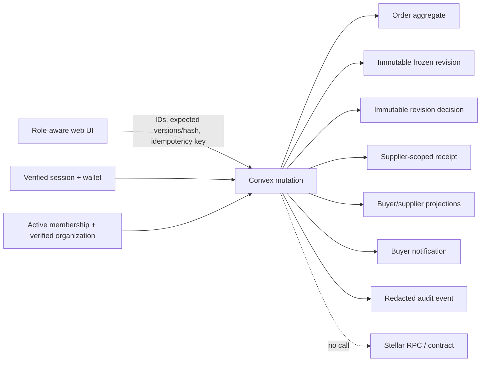
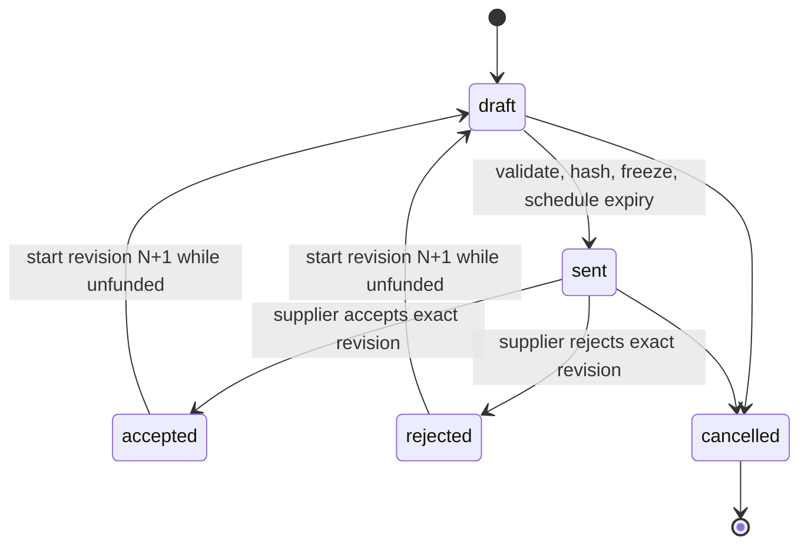
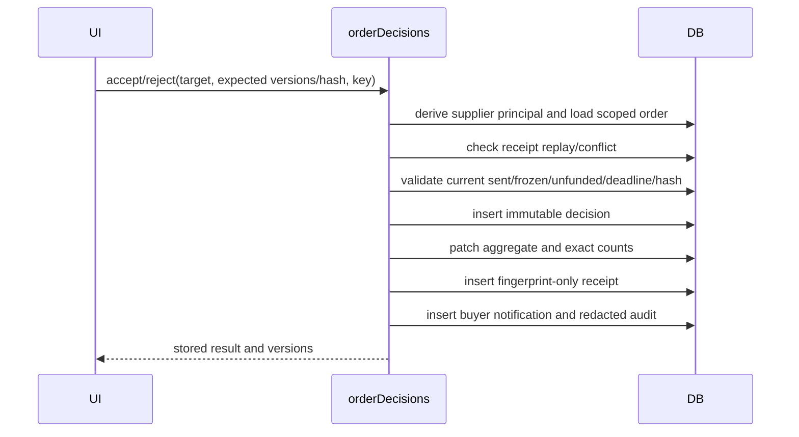

# Supplier Acceptance Architecture

## Boundary

Sprint 5 is entirely off-chain. It records an organization-authorized commercial decision; it does not construct, sign, submit, reconcile, or imply a Stellar transaction. Funding is a later-sprint concern.

The browser supplies only target IDs, expected versions/hash, a decision payload, and an idempotency key. The backend derives the active user, wallet, sole active membership, organization, capability, role, supplier binding, buyer recipient, and authoritative time.

## Lifecycle

The order aggregate is terminal only when cancelled. A revision decision is terminal and immutable. Starting revision N+1 clears current decision and accepted-revision references on the aggregate, but it never changes revision N, its lines, hash, or decision.

## Atomic decision sequence

Convex mutation serialization makes accept, reject, cancel, revision start, and expiry converge on one valid state. Any thrown validation error rolls back the complete side-effect set.

## Deadline projection

Send schedules `supplierOrderDeadlines.expire` for deadline + 1 ms. The job reloads the order and revision and changes only the matching current, sent, undecided `requires_decision` projection. It does not manufacture a rejection or alter `agreementStatus`. Retrying after a decision, cancellation, revision change, or prior expiry is a no-op.

Counts become authoritative after the expiry mutation commits. Decision mutations always enforce the actual server deadline even if the projection job is delayed.

## Projection boundary

`orderDetails.get` returns a discriminated `viewerSide` response.

- Buyer receives the buyer projection, including authorized buyer-internal notes.
- Supplier receives an explicit frozen-snapshot allowlist. It excludes `buyerInternalNotes`, `costCenter`, `projectCode`, session data, authorization internals, audit data, and live organization-profile fields.
- Unknown and foreign orders return the same `ORDER_NOT_FOUND`.

Funding eligibility is computed on the server from the current accepted revision, matching immutable decision/hash, and `unfunded` settlement. The UI does not infer it from a badge.
